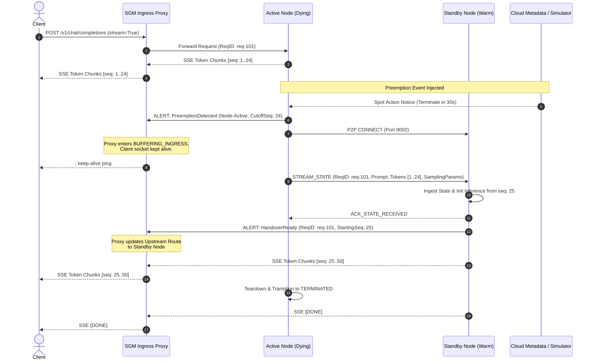

# SGM Architecture Specification: Core System & State Machine

- **Document ID**: `SPEC-001`
- **Component**: Spot GPU Migrator (SGM) System Architecture
- **Sprint**: Sprint 1 (Zero-Downtime Migration Core)
- **Status**: APPROVED
- **Author**: Technical Product Owner (PO)
- **Target Audience**: Software Developer, QA Engineer, UI/UX Developer, Systems Architect

---

## 1. Executive Summary & Core Invariants

Spot and preemptible GPU instances across AWS, GCP, and RunPod present massive cost advantages (65% to 80% discount over on-demand rates), but introduce a fatal trade-off: **unpredictable node termination with strict grace periods** (30 seconds on GCP/RunPod, 120 seconds on AWS). 

The **Spot GPU Migrator (SGM)** solves this by orchestrating live, zero-downtime migration of in-flight LLM inference streams from a terminating ("Active") spot node to a warm ("Standby") spot node.

### Non-Negotiable System Invariants
1. **Zero Dropped Downstream Sockets**: The client-facing HTTP/SSE connection maintained by the Ingress Proxy must NEVER be severed or reset during preemption.
2. **Strict Exactly-Once Token Delivery**: The migrated LLM response received by the client must contain **zero missing tokens** and **zero duplicate tokens**.
3. **Bounded Handover Latency**: End-to-end migration (from metadata detection to Standby node token resumption) must complete in $\le 2.5\text{ seconds}$ (target) and must not exceed $\le 5.0\text{ seconds}$ (hard SLA ceiling), leaving at least 25 seconds of buffer on 30-second preemption notices.
4. **Resilient Failure Fallback**: If peer-to-peer state streaming degrades or fails, the proxy must fallback to deterministic prompt + prefix replay on the Standby node without terminating the downstream stream.

---

## 2. High-Level System Architecture

SGM deploys across three logical layers: the **Ingress Edge Layer**, the **GPU Compute Cluster Layer**, and the **Control & Simulation Layer**.

```mermaid
flowchart TB
    subgraph ClientLayer ["Client & Ingress Edge"]
        Client["Client / User Application\n(HTTP/SSE Streaming Client)"]
        Proxy["SGM Ingress Proxy\n(Port 8000)\n- Active/Standby Route Table\n- Token Sequence Tracker\n- Stream Buffer & Deduplicator"]
    end

    subgraph ActiveNode ["Active Spot Node (Dying Node)"]
        ActiveWatchdog["Preemption Watchdog\n(IMDSv2 / GCP / RunPod Probe)"]
        ActiveDaemon["Node Daemon (Leader)\n(Port 9001 Control API)"]
        ActiveSerializer["State Serializer\n(Zero-Copy Token & Context Snapshot)"]
        ActiveEngine["LLM Inference Engine\n(vLLM / HuggingFace Engine)\n(Port 8001 Local Worker)"]
    end

    subgraph StandbyNode ["Standby Spot Node (Warm Target)"]
        StandbyDaemon["Node Daemon (Standby)\n(Port 9001 Control API)"]
        StandbyReceiver["State Ingestion Engine\n(Port 9002 P2P Binary Channel)"]
        StandbyEngine["LLM Inference Engine\n(Pre-warmed Model Weights)\n(Port 8002 Local Worker)"]
    end

    subgraph SimulationControl ["Simulation & Metadata Layer"]
        CloudMeta["Cloud Metadata Service / Chaos Simulator\n(Port 18000: IMDSv2 / GCP Metadata / Webhook)"]
    end

    Client -->|HTTP POST /v1/chat/completions| Proxy
    Proxy -->|SSE Stream (Req A)| ActiveEngine
    ActiveWatchdog -->|Poll 250ms| CloudMeta
    ActiveWatchdog -->|Preemption Signal| ActiveDaemon
    ActiveDaemon -->|Preemption Alert Broadcast| Proxy
    ActiveDaemon -->|Initiate P2P Handover| StandbyDaemon
    ActiveSerializer -->|High-Speed State Stream (Port 9002)| StandbyReceiver
    StandbyReceiver -->|Load Context & Token Cache| StandbyEngine
    StandbyDaemon -->|Handover Ready ACK| Proxy
    Proxy -.->|Seamlessly Switch Stream| StandbyEngine
```

---

## 3. System Component Specifications

### 3.1 Preemption Watchdog (`daemon/watchdog`)
The Watchdog runs as a lightweight, non-blocking asynchronous daemon process isolated from the main LLM inference loop.

- **Responsibilities**:
  - Continuously polls cloud provider hypervisor metadata endpoints at strict 250ms intervals.
  - Maintains IMDSv2 token cache and automatic token refreshing (AWS).
  - Listens for termination webhooks or pushes from local cloud agents (RunPod/Kubernetes termination notice).
  - Dispatches immediate, high-priority preemption notifications to the local `Node Daemon` within $\le 50\text{ ms}$ of detection.
- **Fault-Tolerance**:
  - Timeout per poll cycle capped at 100ms.
  - Exponential backoff with jitter on network blips, clamping to a maximum interval of 500ms so preemption is never missed.
  - Dedicated non-blocking event loop or background thread to prevent thread starvation under heavy GPU CPU offload.

### 3.2 Node Daemon (`daemon/core`)
The Node Daemon acts as the host supervisor and cluster participant.

- **Responsibilities**:
  - Manages node lifecycle states (`HEALTHY`, `DRAINING`, `MIGRATING`, `TERMINATED`).
  - Coordinates with the `Ingress Proxy` via high-priority gRPC/REST signaling.
  - Discovers and pairs with registered `Standby Nodes` via static configuration or consensus heartbeat.
  - Controls inference engine execution (issuing stop/pause commands to the LLM worker).
  - Triggers the `State Serializer` upon preemption receipt.
  - Sends definitive node termination readiness ACK to the cloud simulator/hypervisor once all states are flushed.

### 3.3 State Serializer (`daemon/serializer`)
The State Serializer captures the operational state of in-flight inference requests with minimal serialization overhead.

- **Payload Captured per In-Flight Request**:
  - `request_id`: Unique UUIDv4 string.
  - `prompt_tokens`: Raw token ID array of the initial prompt.
  - `sampling_params`: Temperature, Top-P, Presence Penalty, Stop Tokens, Max Tokens.
  - `generated_tokens`: Complete list of token IDs emitted up to the pause cutoff.
  - `last_flushed_sequence_id`: Monotonic index of the last token acknowledged by the proxy.
  - `kv_cache_descriptor`: (Optional KV-cache block metadata pointers for zero-recompute engines, or compressed token prefix for warm re-prompting).
- **Format**:
  - Binary framing over TCP (`SGM1` binary frame) or high-efficiency Protocol Buffers / MsgPack to achieve sub-millisecond serialization.

### 3.4 Ingress Proxy (`proxy/`)
The Ingress Proxy is the public-facing gateway for client inference requests.

- **Responsibilities**:
  - Listens on port 8000 for incoming OpenAI-compatible `/v1/chat/completions` and `/v1/completions` requests.
  - Proxies HTTP requests to the currently designated `Active Node`.
  - Parses downstream Server-Sent Event (SSE) token chunks on the fly.
  - Maintains an in-memory **Token Ring Buffer** and monotonic `sequence_id` for every in-flight connection.
  - Upon receiving `PREEMPTION_ALERT`:
    - Enters `BUFFERING` mode: pauses forwarding new downstream chunks if a boundary condition is met, holds client connection open with TCP keep-alives / SSE comment pings (`: keep-alive\n\n`).
    - Halts admission of new requests to the dying Active Node; immediately routes fresh incoming requests to the Standby Node.
    - Waits for `HANDOVER_READY` from the Standby Node.
    - Performs token deduplication: discards any tokens emitted by the Standby Node whose sequence numbers are $\le \text{last\_flushed\_sequence\_id}$.
    - Resumes downstream streaming without resetting the client's HTTP connection.

### 3.5 Cloud Simulator & Chaos Injection Harness (`simulator/`)
The simulator provides a local, reproducible mock of AWS, GCP, and RunPod cloud metadata services.

- **Responsibilities**:
  - Emulates AWS IMDSv2 token issuance (`PUT /latest/api/token`) and instance-action metadata (`GET /latest/meta-data/spot/instance-action`).
  - Emulates GCP Compute Engine metadata endpoint (`GET /computeMetadata/v1/instance/preempted`).
  - Emulates RunPod termination webhooks.
  - Exposes an interactive Chaos Control API (`POST /chaos/preempt`, `POST /chaos/network-delay`, `POST /chaos/drop-packets`) to simulate preemption with controllable deadlines (30s, 120s, or immediate SIGKILL).

---

## 4. State Transition Lifecycle

The migration lifecycle follows a deterministic, unidirectional finite state machine (FSM).

```mermaid
stateDiagram-v2
    [*] --> HEALTHY: Node Boot & Registration
    HEALTHY --> PREEMPTION_DETECTED: Watchdog triggers on Metadata Notice
    PREEMPTION_DETECTED --> BUFFERING_INGRESS: Proxy stops routing new reqs; buffers in-flight
    BUFFERING_INGRESS --> STATE_STREAMING: Serializer pushes active request state to Standby
    STATE_STREAMING --> HANDOVER_COMPLETE: Standby loads state & emits ACK; Proxy swaps upstream
    HANDOVER_COMPLETE --> TERMINATED: Node flushes remaining buffers & shuts down gracefully
    TERMINATED --> [*]

    state PREEMPTION_DETECTED {
        [*] --> NotifyDaemon
        NotifyDaemon --> NotifyProxy
        NotifyProxy --> [*]
    }

    state STATE_STREAMING {
        [*] --> FreezeInference
        FreezeInference --> SerializeContext
        SerializeContext --> TransmitP2P
        TransmitP2P --> [*]
    }
```

### Detailed State Transition Table

| Current State | Trigger Event | Action Taken | Next State | Timeout / Fallback |
| :--- | :--- | :--- | :--- | :--- |
| **`HEALTHY`** | Preemption signal detected by Watchdog (HTTP 200 on spot action) | Watchdog emits `SIG_PREEMPT`; Node Daemon broadcasts alert to Ingress Proxy and Standby Node. | `PREEMPTION_DETECTED` | Polling interval = 250ms. |
| **`PREEMPTION_DETECTED`** | Ingress Proxy acknowledges alert | Proxy stops sending new requests to Active Node. New requests route to Standby. Active Node pauses worker inference loop at clean token boundary. | `BUFFERING_INGRESS` | 300ms SLA. If Proxy fails to ACK, Daemon proceeds autonomously. |
| **`BUFFERING_INGRESS`** | Active Node reaches clean generation boundary | Proxy holds client SSE response stream open; injects keepalive comment pings. Serializer snapshots in-flight requests. | `STATE_STREAMING` | 200ms boundary alignment window. |
| **`STATE_STREAMING`** | State Serializer connects to Standby P2P port 9002 | P2P streaming of active request states, prompt tokens, generated tokens, and sequence cursors over TCP. | `HANDOVER_COMPLETE` | 1500ms max timeout. If P2P stream fails, Proxy falls back to prompt replay on Standby. |
| **`HANDOVER_COMPLETE`** | Standby confirms readiness & resumes token generation | Proxy swaps upstream target for active streams. Proxy deduplicates tokens against `last_flushed_seq`. Stream continues uninterrupted. | `TERMINATED` | 500ms swap window. |
| **`TERMINATED`** | State verified transferred | Active Node Daemon signals hypervisor/simulator of clean shutdown; shuts down worker processes; releases resources. | `[*]` | Node terminates before cloud hard deadline (30s / 120s). |

---

## 5. End-to-End Migration Sequence



---

## 6. Network Topology & Port Allocations

| Port | Service | Protocol | Scope | Description |
| :--- | :--- | :--- | :--- | :--- |
| **`8000`** | SGM Ingress Proxy | HTTP / SSE / WebSocket | Public / Ingress | Client entrypoint for inference requests. |
| **`9001`** | Node Daemon Control API | gRPC / HTTP REST | Cluster Internal | Node heartbeats, lifecycle signaling, preemption alerts. |
| **`9002`** | P2P State Streaming Channel | TCP Binary (`SGM1`) | Node-to-Node Private | High-speed zero-copy streaming of token buffers and request context. |
| **`8001`** | Active Node Local LLM Engine | HTTP / REST | Localhost | Internal inference engine worker on Active Node. |
| **`8002`** | Standby Node Local LLM Engine | HTTP / REST | Localhost | Internal inference engine worker on Standby Node. |
| **`18000`**| Cloud Chaos Simulator | HTTP REST | Test / Dev Harness | Emulates AWS IMDSv2, GCP Metadata, and RunPod webhook endpoints. |

---

## 7. Next Steps & Cross-Specification References
- For detailed bit-level wire formats, AWS/GCP polling loops, and proxy deduplication algorithms, refer to:
  [`specs/02-preemption-and-migration-protocol.md`](file:///C:/Users/mtalha/.gemini/antigravity/scratch/spot-gpu-migrator/specs/02-preemption-and-migration-protocol.md).
- For developer async class interfaces and QA test matrices, refer to:
  [`specs/03-acceptance-criteria.md`](file:///C:/Users/mtalha/.gemini/antigravity/scratch/spot-gpu-migrator/specs/03-acceptance-criteria.md).
