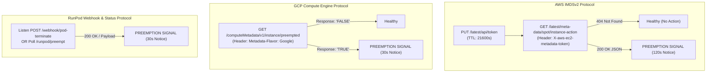
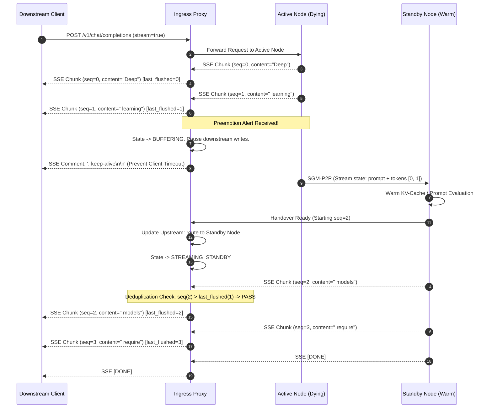

# SGM Protocol Specification: Cloud Preemption Detection, P2P State Streaming, & Ingress Proxy Handover

- **Document ID**: `SPEC-002`
- **Component**: Wire Protocols, Preemption Detectors, and Proxy Migration Engine
- **Sprint**: Sprint 1 (Zero-Downtime Migration Core)
- **Status**: APPROVED
- **Author**: Technical Product Owner (PO)
- **Target Audience**: Software Developer, QA Engineer, Network Engineers

---

## 1. Overview & Protocol Stack

This specification defines the three core network and signaling protocols that underpin zero-downtime spot GPU migration:
1. **Cloud Preemption Detection Protocols**: Deterministic polling specifications for AWS IMDSv2, GCP Compute Engine Metadata, and RunPod webhook/status endpoints.
2. **P2P State Streaming Wire Protocol (`SGM-P2P`)**: Low-latency binary framing protocol for transmitting in-flight request contexts, token history, and KV descriptors from Active to Standby nodes.
3. **Ingress Proxy Handover Protocol**: Token sequencing, connection retention, buffer deduplication, and upstream multiplexing for continuous SSE/HTTP inference streams.

---

## 2. Cloud Preemption Detection Protocols

The Preemption Watchdog executes non-blocking background polling against hypervisor metadata endpoints every **250 milliseconds**, with an aggressive **100 millisecond connection/read timeout**.



### 2.1 AWS IMDSv2 Specification

AWS provides a **120-second warning** before terminating a spot instance. In accordance with IMDSv2 security requirements, all requests must be authenticated via a session token.

#### Step 1: Session Token Acquisition
- **Method & URI**: `PUT http://169.254.169.254/latest/api/token`
- **Required Header**: `X-aws-ec2-metadata-token-ttl-seconds: 21600` (6 hours)
- **Response**: `200 OK` with raw token string in body.
- **Refresh Rule**: Token is refreshed proactively every 3 hours ($10,800\text{ s}$) or immediately upon receiving a `401 Unauthorized` status.

#### Step 2: Spot Instance Action Polling
- **Method & URI**: `GET http://169.254.169.254/latest/meta-data/spot/instance-action`
- **Required Header**: `X-aws-ec2-metadata-token: <ACTIVE_TOKEN>`
- **Response Handling**:
  - `404 Not Found`: Normal condition. Node is healthy and NOT marked for preemption.
  - `200 OK`: **Preemption scheduled**. Response body format:
    ```json
    {
      "action": "terminate",
      "time": "2026-09-23T12:47:30Z"
    }
    ```
  - Parse `time` as ISO 8601 UTC timestamp; calculate remaining deadline delta $T_{\text{remain}} = T_{\text{action}} - T_{\text{now}}$.
  - Immediately raise `PreemptionEvent(provider="aws", action="terminate", deadline=time)`.

---

### 2.2 Google Cloud Platform (GCP) Metadata Specification

GCP provides a strict **30-second warning** before preempting Spot / Preemptible VMs.

#### Primary Preemption Polling
- **Method & URI**: `GET http://metadata.google.internal/computeMetadata/v1/instance/preempted`
- **Required Header**: `Metadata-Flavor: Google`
- **Response Handling**:
  - `200 OK` with body `"FALSE"`: Normal healthy state.
  - `200 OK` with body `"TRUE"`: **Preemption triggered**. Immediately raise `PreemptionEvent(provider="gcp", deadline_seconds=30)`.
  - Any connection timeout or HTTP error triggers immediate single retry after 50ms.

#### Secondary Maintenance Event Check (Simultaneous or alternate tick)
- **Method & URI**: `GET http://metadata.google.internal/computeMetadata/v1/instance/maintenance-event`
- **Required Header**: `Metadata-Flavor: Google`
- **Response Handling**:
  - Body `"NONE"`: Normal.
  - Body `"TERMINATE_ON_HOST_MAINTENANCE"`: Immediate preemption notice.

---

### 2.3 RunPod Termination Specification

RunPod spot pods provide a **30-second warning**. SGM supports dual-channel detection:

1. **Inbound Webhook Receiver** (`daemon/watchdog/runpod_webhook.py`):
   - Listens on `http://0.0.0.0:9001/webhook/runpod-terminate`
   - Payload:
     ```json
     {
       "event": "POD_TERMINATION_NOTICE",
       "pod_id": "pod-gpu-xyz987",
       "grace_period_seconds": 30,
       "timestamp": 1790184425
     }
     ```
   - Triggers `PreemptionEvent` synchronously upon webhook receipt.
2. **Local Agent Status Poller**:
   - Polling `http://127.0.0.1:18000/runpod/preempt` or local environment trigger file `/tmp/runpod_terminate_notice`.

---

### 2.4 Cloud Chaos Simulator Contract

The Cloud Chaos Simulator (`simulator/server.py`) binds to port 18000 and simulates hypervisors:
- `PUT /latest/api/token` -> Returns mock IMDSv2 token.
- `GET /latest/meta-data/spot/instance-action` -> Returns 404 until triggered, then 200 with JSON termination payload.
- `GET /computeMetadata/v1/instance/preempted` -> Returns `"FALSE"` until triggered, then `"TRUE"`.
- `POST /chaos/inject-preemption` -> Body `{"provider": "aws"|"gcp"|"runpod", "notice_seconds": 30|120}`. Flips simulator state instantly.

---

## 3. P2P State Streaming Protocol (`SGM-P2P` v1.0)

When preemption is detected, the Active Node establishes a dedicated TCP connection to the Standby Node on port 9002 using the binary `SGM-P2P` framing protocol.

### 3.1 Binary Frame Structure

All integers are serialized in Network Byte Order (Big-Endian).

```
 0                   1                   2                   3
 0 1 2 3 4 5 6 7 8 9 0 1 2 3 4 5 6 7 8 9 0 1 2 3 4 5 6 7 8 9 0 1
+-+-+-+-+-+-+-+-+-+-+-+-+-+-+-+-+-+-+-+-+-+-+-+-+-+-+-+-+-+-+-+-+
|                  Magic Bytes ('S', 'G', 'M', '1')             |
+-+-+-+-+-+-+-+-+-+-+-+-+-+-+-+-+-+-+-+-+-+-+-+-+-+-+-+-+-+-+-+-+
|  Version (1)  | Msg Type (1B) |          Flags (2B)           |
+-+-+-+-+-+-+-+-+-+-+-+-+-+-+-+-+-+-+-+-+-+-+-+-+-+-+-+-+-+-+-+-+
|                     Payload Length (4B, uint32)               |
+-+-+-+-+-+-+-+-+-+-+-+-+-+-+-+-+-+-+-+-+-+-+-+-+-+-+-+-+-+-+-+-+
|                     CRC32 Checksum (4B, uint32)               |
+-+-+-+-+-+-+-+-+-+-+-+-+-+-+-+-+-+-+-+-+-+-+-+-+-+-+-+-+-+-+-+-+
|                     Payload Data (N Bytes) ...                |
+-+-+-+-+-+-+-+-+-+-+-+-+-+-+-+-+-+-+-+-+-+-+-+-+-+-+-+-+-+-+-+-+
```

#### Field Specifications:
- **Magic Bytes** (4 Bytes): `0x53 0x47 0x4D 0x31` (ASCII `"SGM1"`). Packets lacking this prefix are dropped immediately.
- **Version** (1 Byte): `0x01` (Version 1.0).
- **Message Type** (1 Byte):
  - `0x01` (`HANDOVER_INIT`): Initiates handover session; contains node metadata and request count.
  - `0x02` (`REQUEST_STATE`): Contains serialized state for a single in-flight LLM inference request.
  - `0x03` (`TOKEN_DELTA`): Incremental batch of recently generated tokens.
  - `0x04` (`KV_CACHE_DESC`): KV cache block map descriptor (for zero-recompute engines).
  - `0x05` (`HANDOVER_FIN`): Indicates all active request states have been streamed.
  - `0x06` (`HANDOVER_ACK`): Standby node confirmation that requests are restored and ready.
  - `0x07` (`HANDOVER_NACK`): Standby rejection or deserialization failure.
  - `0x08` (`HEARTBEAT`): Liveness ping between Active and Standby nodes.
- **Flags** (2 Bytes, Bitfield):
  - Bit 0: `IS_COMPRESSED` (Payload is compressed with Zstandard).
  - Bit 1: `IS_LAST_CHUNK` (Final chunk for this request).
  - Bits 2-15: Reserved for future extensions (must be 0).
- **Payload Length** (4 Bytes): Unsigned 32-bit integer specifying payload size in bytes. Maximum frame size is $16\text{ MB}$.
- **CRC32 Checksum** (4 Bytes): IEEE 802.3 CRC32 of the Payload Data. Evaluated by receiver; mismatch triggers immediate `HANDOVER_NACK`.

---

### 3.2 Payload Data Contracts

#### Message Type `0x01`: `HANDOVER_INIT`
```json
{
  "protocol_version": "1.0",
  "source_node_id": "spot-node-us-east-1a-gpu-01",
  "target_node_id": "spot-node-us-east-1b-gpu-02",
  "preemption_deadline_utc": "2026-09-23T12:47:30Z",
  "active_request_count": 8,
  "timestamp_ns": 1790184425123456789
}
```

#### Message Type `0x02`: `REQUEST_STATE`
```json
{
  "request_id": "req-9883f06e-8e81-4ebc-8a8b-12d837651a2e",
  "client_connection_id": "conn-client-5542",
  "model": "meta-llama/Llama-3-8b-instruct",
  "prompt_tokens": [128000, 2023, 11, 311, 235],
  "sampling_params": {
    "temperature": 0.7,
    "top_p": 0.95,
    "max_tokens": 512,
    "stop": ["<|eot_id|>"]
  },
  "generated_tokens": [1820, 432, 1105, 945, 230],
  "last_flushed_sequence_id": 4,
  "total_tokens_generated": 5,
  "is_streaming": true,
  "stream_cutoff_timestamp_ns": 1790184425234567890
}
```

#### Message Type `0x06`: `HANDOVER_ACK`
```json
{
  "source_node_id": "spot-node-us-east-1a-gpu-01",
  "accepted_request_ids": [
    "req-9883f06e-8e81-4ebc-8a8b-12d837651a2e"
  ],
  "rejected_request_ids": [],
  "standby_ready_timestamp_ns": 1790184425456789012,
  "resume_port": 8002
}
```

---

## 4. Ingress Proxy Handover Logic & Token Ring Buffer

The Ingress Proxy maintains the persistent client HTTP/SSE connection and dynamically swaps upstreams.

### 4.1 Connection Lifecycle & Data Structures

For each active streaming request, the Ingress Proxy maintains a `StreamSessionContext`:

```python
class StreamSessionContext:
    request_id: str
    client_writer: asyncio.StreamWriter      # Downstream client socket
    active_upstream_reader: asyncio.StreamReader
    standby_upstream_reader: asyncio.StreamReader | None
    
    # State tracking
    state: Literal["STREAMING_ACTIVE", "BUFFERING", "SWAPPING", "STREAMING_STANDBY", "COMPLETED"]
    
    # Sequence & Deduplication Tracking
    last_flushed_sequence: int = -1          # Monotonic index of last token sent to client
    token_ring_buffer: RingBuffer[TokenChunk] # Size: 1024 chunks
    active_node_id: str
    standby_node_id: str
```



---

### 4.2 Seamless Upstream Swap Algorithm

1. **Steady-State Phase**:
   - Active Node streams SSE events: `data: {"id":"chat-1","choices":[{"delta":{"content":"foo"}}],"seq":N}\n\n`.
   - Proxy writes chunk downstream to `client_writer`.
   - Proxy sets `last_flushed_sequence = N`.
   - Stores chunk in `token_ring_buffer[N % 1024]`.

2. **Preemption Phase**:
   - Proxy receives `PREEMPTION_ALERT` from Daemon with `cutoff_sequence_id = K`.
   - Proxy transitions `session.state = "BUFFERING"`.
   - Proxy stops reading from Active Node once `seq == K` is reached, or closes Active Node upstream read channel after draining up to `K`.
   - If downstream client has received no bytes for $> 800\text{ ms}$, Proxy writes `: keep-alive\n\n` to prevent client read timeouts.

3. **Handover Execution Phase**:
   - Standby Node initializes generation using the full sequence up to token $K$.
   - Standby Node begins streaming response starting at sequence $K+1$.
   - Proxy opens upstream read channel to Standby Node.
   - For every incoming chunk `chunk` from Standby Node:
     ```python
     if chunk.sequence_id <= session.last_flushed_sequence:
         # DEDUPLICATION: Standby re-emitted an already flushed token.
         logger.debug("Discarding duplicate token %d (last flushed: %d)", 
                      chunk.sequence_id, session.last_flushed_sequence)
         continue
     
     if chunk.sequence_id != session.last_flushed_sequence + 1:
         # GAP DETECTION: Missed a token!
         logger.error("Token gap detected: expected %d, got %d", 
                      session.last_flushed_sequence + 1, chunk.sequence_id)
         raise MigrationTokenGapError(f"Gap: {session.last_flushed_sequence} to {chunk.sequence_id}")

     # Emit to downstream client
     await session.client_writer.write(chunk.raw_bytes)
     await session.client_writer.drain()
     session.last_flushed_sequence = chunk.sequence_id
     ```

4. **Completion Phase**:
   - Standby Node delivers `data: [DONE]\n\n`.
   - Proxy forwards `data: [DONE]\n\n` to client and closes client connection gracefully.

---

## 5. Edge-Case Failure Modes & Recovery Strategies

| Failure Mode | Detection Mechanism | Recovery & Fallback Strategy |
| :--- | :--- | :--- |
| **Standby Node Unreachable during P2P Transfer** | TCP `ConnectTimeout` or `ECONNREFUSED` on port 9002 after 500ms. | Active Node informs Proxy of `HANDOVER_FAILED`. Proxy routes fresh full prompt + all accumulated `generated_tokens` to an on-demand fallback node or secondary spot standby. |
| **CRC32 Checksum Mismatch in P2P Stream** | Standby node detects corrupt frame header/payload. | Standby sends `HANDOVER_NACK`. Active node immediately retries frame transfer (maximum 2 retries). If retries fail, fallback to prompt replay. |
| **Client Disconnects Mid-Migration** | `ConnectionResetError` or `BrokenPipeError` on downstream `client_writer`. | Proxy logs connection abort, notifies Standby Node to cancel generation for `request_id`, releases buffers, frees GPU compute. |
| **Token Gap / Discontinuity from Standby** | Standby yields token with sequence $M > \text{last\_flushed\_seq} + 1$. | Proxy queries Standby Node buffer cache for missing tokens $[ \text{last\_flushed\_seq} + 1 \dots M - 1 ]$. If unrecoverable, restarts inference segment from last known checkpoint. |
| **Metadata Endpoint Outage (500 Internal Error)** | IMDSv2 / GCP metadata responds with 5xx or resets. | Watchdog logs warning, applies 50ms exponential backoff (up to 500ms ceiling), does not crash. Last known health status is maintained. |
