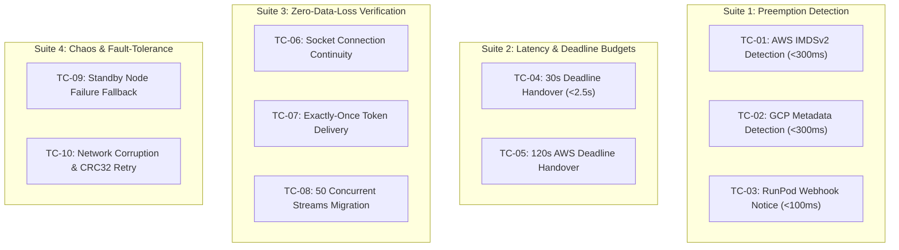

# SGM Technical Specification: Acceptance Criteria, Developer Interfaces, & QA Test Matrix

- **Document ID**: `SPEC-003`
- **Component**: Engineering Contracts, Class Interfaces, and Quality Assurance Test Suite
- **Sprint**: Sprint 1 (Zero-Downtime Migration Core)
- **Status**: APPROVED
- **Author**: Technical Product Owner (PO)
- **Target Audience**: Software Developer, QA Engineer, Project Manager

---

## 1. Overview & Objective

This specification establishes the technical implementation contracts for the **Software Developer** and the test verification criteria for the **QA Engineer**. All components must satisfy strict invariants regarding asynchronous non-blocking execution, error resilience, latency budgets, and zero data loss.

---

## 2. Requirements for the Software Developer

### 2.1 Directory & Module Layout
The codebase must be structured as follows:

```
spot-gpu-migrator/
├── daemon/
│   ├── __init__.py
│   ├── core.py                   # NodeDaemon coordination logic
│   ├── models.py                 # Pydantic & dataclass schemas
│   ├── watchdog/
│   │   ├── __init__.py
│   │   ├── base.py               # AbstractPreemptionWatchdog
│   │   ├── aws.py                # AWS IMDSv2 poller
│   │   ├── gcp.py                # GCP computeMetadata poller
│   │   └── runpod.py             # RunPod webhook & status poller
│   └── serializer/
│       ├── __init__.py
│       ├── binary.py             # SGM-P2P frame encoder/decoder
│       └── session.py            # InferenceSession serializer
├── proxy/
│   ├── __init__.py
│   ├── server.py                 # FastAPI / AsyncIO Ingress Proxy
│   ├── buffer.py                 # TokenRingBuffer & Deduplicator
│   └── upstream.py               # Active/Standby stream multiplexer
├── simulator/
│   ├── __init__.py
│   ├── server.py                 # Cloud Chaos Mock Server (port 18000)
│   └── chaos.py                  # Failure injection & latency simulator
├── tests/
│   ├── conftest.py
│   ├── test_watchdog.py          # Unit tests for cloud metadata pollers
│   ├── test_serializer.py        # Frame encoding & CRC32 verification
│   ├── test_proxy_buffer.py      # Deduplication & ring buffer logic
│   ├── test_integration_live.py  # End-to-end zero-loss migration tests
│   └── test_chaos_deadlines.py   # 30s/120s deadline & network chaos tests
└── specs/                        # Architecture and RFC specifications
```

---

### 2.2 Core Interfaces & Async Method Signatures

The Software Developer must implement the following abstract interfaces using `typing` and `abc`:

#### A. Preemption Watchdog (`daemon/watchdog/base.py`)
```python
from abc import ABC, abstractmethod
from typing import Callable, Awaitable
from daemon.models import PreemptionEvent

PreemptionCallback = Callable[[PreemptionEvent], Awaitable[None]]

class AbstractPreemptionWatchdog(ABC):
    """Abstract interface for hypervisor spot preemption watchers."""

    @abstractmethod
    def __init__(self, poll_interval_ms: int = 250, timeout_ms: int = 100) -> None:
        """Initialize watchdog with configurable polling frequency and timeout."""
        pass

    @abstractmethod
    def register_callback(self, callback: PreemptionCallback) -> None:
        """Register an async callback invoked immediately upon preemption detection."""
        pass

    @abstractmethod
    async def start(self) -> None:
        """Start the background non-blocking polling task."""
        pass

    @abstractmethod
    async def stop(self) -> None:
        """Gracefully stop the polling loop and release network resources."""
        pass

    @abstractmethod
    async def check_once(self) -> PreemptionEvent | None:
        """Execute a single polling probe against metadata endpoint."""
        pass
```

#### B. State Serializer (`daemon/serializer/session.py`)
```python
from abc import ABC, abstractmethod
from daemon.models import InferenceSession, HandoverInit, HandoverAck

class AbstractStateSerializer(ABC):
    """Handles low-latency zero-copy snapshotting and P2P transmission of inference state."""

    @abstractmethod
    def pack_frame(self, msg_type: int, payload: bytes, flags: int = 0) -> bytes:
        """Encode raw payload into SGM-P2P binary frame with magic bytes and CRC32."""
        pass

    @abstractmethod
    def unpack_frame(self, raw_bytes: bytes) -> tuple[int, int, bytes]:
        """Validate CRC32, magic bytes, and unpack frame returning (msg_type, flags, payload)."""
        pass

    @abstractmethod
    async def send_handover(
        self, 
        target_host: str, 
        target_port: int, 
        sessions: list[InferenceSession]
    ) -> HandoverAck:
        """Transmit all active sessions to the Standby node over TCP socket."""
        pass

    @abstractmethod
    async def receive_handover(
        self, 
        listen_host: str, 
        listen_port: int
    ) -> list[InferenceSession]:
        """Listen on P2P port, ingest frames, validate integrity, and reconstruct sessions."""
        pass
```

#### C. Ingress Proxy Engine (`proxy/buffer.py`, `proxy/upstream.py`)
```python
from abc import ABC, abstractmethod
from typing import AsyncIterator
from daemon.models import TokenChunk

class AbstractTokenDeduplicator(ABC):
    """Tracks token sequence IDs and prevents duplicate delivery during switchover."""

    @abstractmethod
    def record_flushed(self, request_id: str, seq_id: int) -> None:
        """Record that token with seq_id has been successfully flushed to the downstream client."""
        pass

    @abstractmethod
    def filter_chunk(self, request_id: str, chunk: TokenChunk) -> TokenChunk | None:
        """
        Evaluate incoming chunk from upstream.
        Returns chunk if seq_id == last_flushed + 1.
        Returns None if seq_id <= last_flushed (duplicate).
        Raises TokenSequenceGapError if seq_id > last_flushed + 1.
        """
        pass

class AbstractStreamMultiplexer(ABC):
    """Multiplexes downstream client connection across Active and Standby upstreams."""

    @abstractmethod
    async def stream_with_handover(
        self, 
        request_id: str, 
        active_upstream: AsyncIterator[TokenChunk],
        standby_factory: Callable[[], Awaitable[AsyncIterator[TokenChunk]]]
    ) -> AsyncIterator[bytes]:
        """
        Yields raw SSE chunks to downstream client.
        Seamlessly transitions to standby_factory generator when preemption occurs.
        """
        pass
```

---

### 2.3 Strict Concurrency & Async Standards
1. **Zero Synchronous I/O**: No synchronous blocking calls (`time.sleep`, `requests.get`, `socket.recv`) inside async methods. Use `asyncio.sleep`, `httpx.AsyncClient` or `aiohttp`, and `asyncio.open_connection`.
2. **Structured Concurrency**: Background tasks must be managed via `asyncio.TaskGroup` (Python 3.11+) or monitored background lists with explicit cleanup on shutdown.
3. **Graceful Cancellation**: Every loop must properly catch and propagate `asyncio.CancelledError`, ensuring all open sockets and file descriptors are closed without resource leakage.
4. **Timeouts**: Every network call (IMDSv2 polling, P2P connection, Standby upstream connect) must be wrapped in `asyncio.timeout(seconds)`.

---

### 2.4 Error Handling & Fallback Specifications

| Exception Class | Cause | Developer Handling Requirement |
| :--- | :--- | :--- |
| `MetadataPollTimeoutError` | Metadata endpoint took $> 100\text{ ms}$. | Log warning at `DEBUG` level; do NOT crash loop; wait for next 250ms interval. |
| `IMDSv2TokenExpiredError` | AWS IMDSv2 returned 401 Unauthorized. | Invalidate cached token immediately; issue synchronous `PUT /latest/api/token` refresh. |
| `P2PConnectionFailedError` | Standby port 9002 unreachable. | Log error; notify Proxy to trigger fallback route (direct prompt replay on secondary node). |
| `CRC32VerificationError` | Bit corruption in binary frame. | Reject frame; send `HANDOVER_NACK` with error code `0x01`; request frame retransmission. |
| `TokenSequenceGapError` | Standby emitted token $K+2$ when $K$ was expected. | Log fatal stream gap; request missing chunk from Standby buffer; if unavailable, reset context. |
| `ClientDisconnectedError` | Downstream client severed TCP socket. | Immediately cancel upstream inference tasks; free GPU worker context; discard buffers. |

---

## 3. QA Test Matrix & Concrete Test Cases

The QA Engineer must automate the following test suites using `pytest` and `pytest-asyncio`.



### 3.1 Test Suite 1: Cloud Preemption Detection Verification

#### `TC-01`: AWS IMDSv2 Polling & Token Management
- **Preconditions**: Cloud Simulator running on port 18000 configured for AWS mode.
- **Action**:
  1. Watchdog boots and requests token via `PUT /latest/api/token`.
  2. Watchdog polls `GET /latest/meta-data/spot/instance-action` returning 404.
  3. Simulator triggers preemption: `POST /chaos/inject-preemption {"provider":"aws","notice_seconds":120}`.
- **Pass Criteria**:
  - Callback triggered in $\le 300\text{ ms}$ of injection.
  - `PreemptionEvent.provider == "aws"` and `PreemptionEvent.deadline_seconds == 120`.
  - Token refresh verified: Expire token in simulator; watchdog must fetch new token on next tick without crashing.

#### `TC-02`: GCP Compute Engine Metadata Verification
- **Preconditions**: Cloud Simulator configured for GCP mode.
- **Action**:
  1. Watchdog polls `/computeMetadata/v1/instance/preempted` returning `"FALSE"`.
  2. Watchdog sends missing `Metadata-Flavor` header -> verify simulator rejects with 403, watchdog handles error.
  3. Simulator injects preemption: returns `"TRUE"`.
- **Pass Criteria**:
  - Callback triggered in $\le 300\text{ ms}$.
  - `PreemptionEvent.provider == "gcp"` and `PreemptionEvent.deadline_seconds == 30`.

#### `TC-03`: RunPod Webhook Notification
- **Preconditions**: RunPod webhook listener running on port 9001.
- **Action**:
  - Simulator fires `POST http://localhost:9001/webhook/runpod-terminate` with valid signature.
- **Pass Criteria**:
  - Callback executed in $\le 100\text{ ms}$.

---

### 3.2 Test Suite 2: Migration Deadline Budget & Latency SLA

#### `TC-04`: 30-Second Preemption Profile (GCP / RunPod)
- **Preconditions**:
  - Active Node generating streaming response (total prompt: 128 tokens, generation target: 200 tokens).
  - Standby Node running on standby port 8002.
  - Proxy routing traffic to Active Node.
- **Action**:
  - Inject 30-second preemption notice at token 50.
- **Pass Criteria**:
  - **Total Handover Latency** (from detection to first token streamed from Standby): $\le 2500\text{ ms}$ (Target), $\le 5000\text{ ms}$ (Hard SLA ceiling).
  - Active Node cleanly issues `TERMINATED` state and shuts down within $\le 8.0\text{ seconds}$ total, leaving $> 22\text{ seconds}$ before hypervisor shutdown.

#### Latency Budget Allocation Table
| Migration Stage | Target Budget | Hard Ceiling | Description |
| :--- | :--- | :--- | :--- |
| **Detection ($T_{\text{detect}}$)** | $\le 250\text{ ms}$ | $300\text{ ms}$ | From cloud event occurrence to callback execution. |
| **Ingress Buffering ($T_{\text{buffer}}$)** | $\le 100\text{ ms}$ | $200\text{ ms}$ | Proxy pauses downstream writes and issues keepalive ping. |
| **State Serialization ($T_{\text{serialize}}$)** | $\le 150\text{ ms}$ | $300\text{ ms}$ | Active node snapshots in-flight request contexts. |
| **P2P Network Transfer ($T_{\text{transfer}}$)** | $\le 500\text{ ms}$ | $1200\text{ ms}$ | Streaming binary frames across node-to-node private network. |
| **Standby Context Load ($T_{\text{load}}$)** | $\le 1200\text{ ms}$ | $2500\text{ ms}$ | Standby worker ingests tokens and prepares forward pass. |
| **Proxy Route Swap ($T_{\text{swap}}$)** | $\le 50\text{ ms}$ | $100\text{ ms}$ | Proxy connects to standby stream and resumes delivery. |
| **TOTAL Handover Time ($T_{\text{total}}$)** | **$\le 2250\text{ ms}$** | **$\le 4600\text{ ms}$** | **Client perceived pause duration.** |

---

### 3.3 Test Suite 3: Zero-Data-Loss & Streaming Continuity

#### `TC-06`: Downstream Socket Connection Persistence
- **Action**: Client initiates streaming request via `curl` or `httpx`. Preemption is injected mid-stream.
- **Pass Criteria**:
  - Client TCP connection does NOT reset (`ECONNRESET` count == 0).
  - Client receives HTTP 200 header once; chunked transfer encoding stream remains unbroken.
  - Intermediate SSE `: keep-alive\n\n` comments are received if pause exceeds 800ms.

#### `TC-07`: Exactly-Once Token Delivery (Zero Missing, Zero Duplicate)
- **Preconditions**:
  - Predictable generation sequence: Ground truth text = `"The quick brown fox jumps over the lazy dog and runs across the wide open fields towards the green mountains."` (20 words / tokens).
- **Action**:
  - Inject preemption when token 7 (`"jumps"`) has been emitted by Active Node.
  - Standby Node takes over and completes the remainder of the generation.
- **Pass Criteria**:
  - Concatenated client stream output must match Ground Truth with **$100\%$ string identity**:
    `assert client_received_text == ground_truth_text`
  - Assert duplicate token count == 0.
  - Assert omitted token count == 0.

#### `TC-08`: High-Concurrency Multi-Stream Migration Stress Test
- **Preconditions**: 50 concurrent client connections streaming distinct prompts simultaneously.
- **Action**:
  - Trigger preemption notice when all 50 connections are actively generating (at random token offsets between 20 and 80).
- **Pass Criteria**:
  - 50 out of 50 connections ($100\%$) complete successfully.
  - Zero dropped connections.
  - Zero token duplication across all 50 streams.
  - P2P wire transfer time for all 50 sessions $\le 1500\text{ ms}$.

---

### 3.4 Test Suite 4: Chaos & Fault-Tolerance Verification

#### `TC-09`: Standby Node Failure / Fallback
- **Preconditions**: Standby Node is forcibly terminated (`kill -9`) prior to preemption injection.
- **Action**: Active Node receives preemption; attempts P2P connection to Standby port 9002 (refused).
- **Pass Criteria**:
  - Active Node catches connection error without crashing.
  - SGM Ingress Proxy activates secondary fallback node or gracefully returns HTTP 503 Service Unavailable with JSON error schema rather than dropping TCP connection abruptly.

#### `TC-10`: Network Packet Corruption & CRC32 Retry
- **Preconditions**: Chaos proxy inserted on port 9002 with 10% bit-flip corruption rate.
- **Action**: Transmit binary state frames between Active and Standby nodes.
- **Pass Criteria**:
  - Standby receiver detects corrupted CRC32 checksum.
  - Standby issues `HANDOVER_NACK` (Type `0x07`).
  - Active node retransmits frame successfully.
  - Handover completes without corrupting session tokens.

---

## 4. Definition of Done (DoD) for Sprint 1

For Sprint 1 deliverables to be accepted:
1. All three specification documents (`specs/01-system-architecture.md`, `specs/02-preemption-and-migration-protocol.md`, `specs/03-acceptance-criteria.md`) are approved and checked into Git.
2. Core code implemented adhering to `typing`, Python 3.11+ async standards, and passing static analysis (`ruff check .`, `mypy --strict .`).
3. Automated test suite passes 100% of test cases (`TC-01` through `TC-10`).
4. Unit and integration test coverage $\ge 85\%$.
5. Live chaos demonstration script executes without manual intervention and demonstrates zero lost tokens on simulated 30s preemption.
