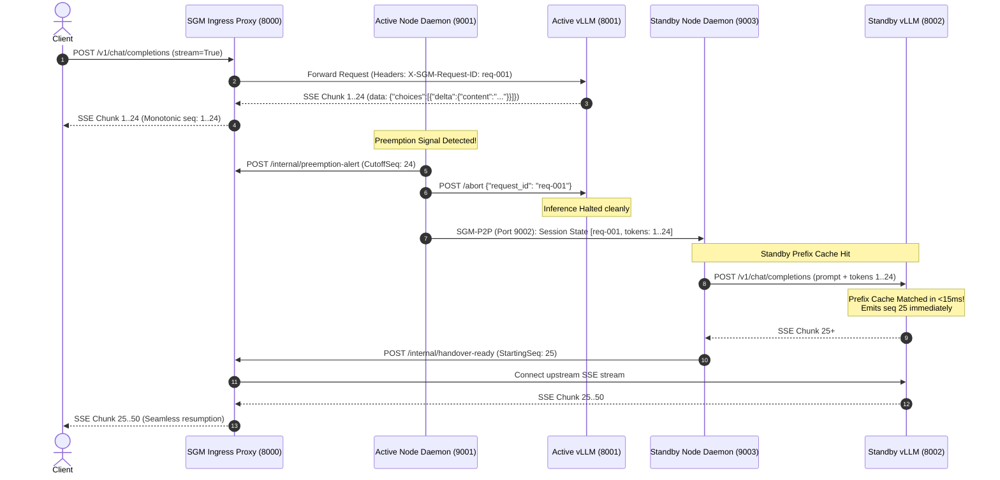
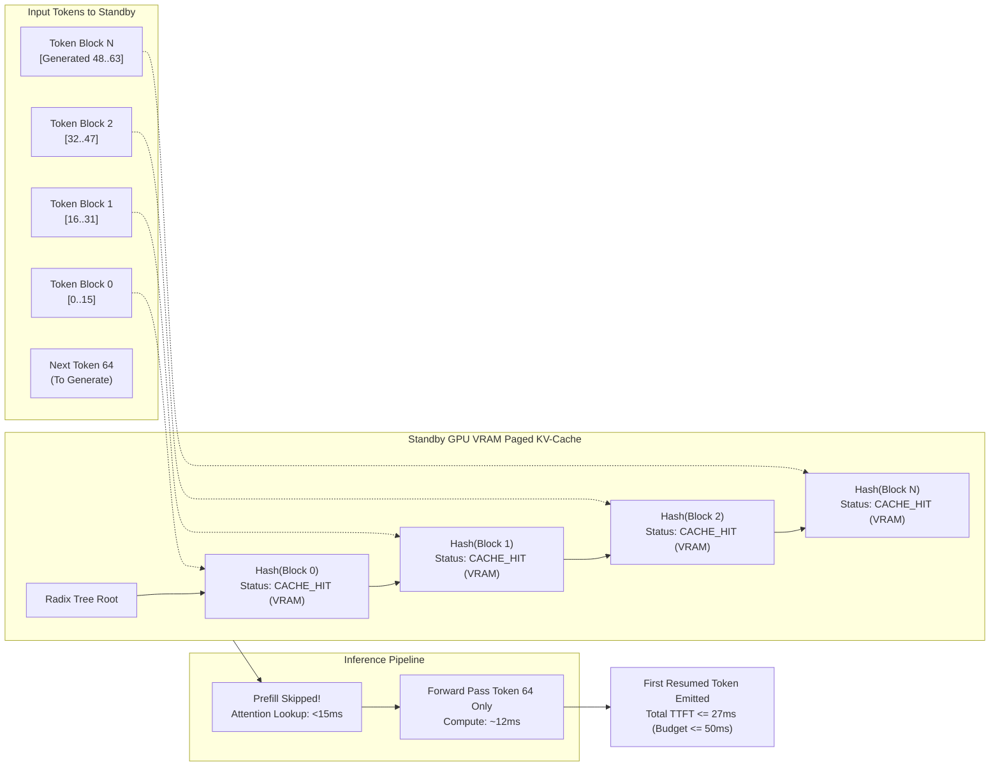

# SGM Milestone 2 Specification: Real vLLM Integration, Containerization, & Cloud Spot Deployment

- **Document ID**: `SPEC-004`
- **Component**: Production Packaging, Real vLLM / SGLang Engine Integration, & Cloud Spot Automation
- **Sprint**: Milestone 2 (Production Packaging & Cloud Deployment)
- **Status**: APPROVED
- **Author**: Technical Product Owner (PO)
- **Target Audience**: Systems Architect, Software Developer, DevOps / Infrastructure Engineer, QA Engineer, Project Manager

---

## 1. Executive Summary & Production Objectives

Milestone 1 established the core zero-downtime migration protocol (`SGM-P2P`), monotonic token ring buffers, sub-millisecond serialization, and cloud metadata watchdogs against synthetic simulation harnesses. 

**Milestone 2 transitions the Spot GPU Migrator (SGM) from local simulation to production GPU environments.** This specification establishes the engineering contracts, architecture, container topology, and cloud provisioning scripts necessary to execute live migrations on real NVIDIA GPU hardware running state-of-the-art inference engines: **vLLM** and **SGLang**.

```mermaid
flowchart TB
    subgraph IngressEdge ["Public Edge (Ingress)"]
        Client["Client / User Application\n(HTTP/SSE Stream)"]
        Proxy["SGM Ingress Proxy Container\n(Port 8000)\nImage: sgm-proxy:latest"]
    end

    subgraph AWS_Spot_Active ["Active Spot Node (AWS EC2 / RunPod)"]
        ActiveWatchdog["Preemption Watchdog\n(AWS IMDSv2 / RunPod Webhook)"]
        ActiveDaemon["SGM Node Daemon Container\n(Port 9001 Control)\nImage: sgm-daemon:latest"]
        ActiveEngine["vLLM Inference Container\n(Port 8001 OpenAI API)\n--enable-prefix-caching"]
        ActiveGPU[("NVIDIA GPU VRAM\nKV-Cache Block Pool")]
    end

    subgraph AWS_Spot_Standby ["Standby Spot Node (Warm Backup)"]
        StandbyDaemon["SGM Node Daemon Container\n(Port 9003 Control / 9002 P2P)\nImage: sgm-daemon:latest"]
        StandbyEngine["vLLM Inference Container\n(Port 8002 OpenAI API)\n--enable-prefix-caching"]
        StandbyGPU[("NVIDIA GPU VRAM\nPre-warmed Model Weights")]
    end

    Client -->|HTTP POST /v1/chat/completions| Proxy
    Proxy -->|SSE Token Stream| ActiveEngine
    ActiveEngine --- ActiveGPU
    ActiveWatchdog -->|Preemption Notice| ActiveDaemon
    ActiveDaemon -->|Preemption Alert| Proxy
    ActiveDaemon -->|SGM1 State Stream (Port 9002)| StandbyDaemon
    StandbyDaemon -->|Resume with Prefix Cache Hit| StandbyEngine
    StandbyEngine --- StandbyGPU
    StandbyDaemon -->|Handover Ready ACK| Proxy
    Proxy -.->|Seamless Route Cutover| StandbyEngine
```

### Core Production SLAs & Invariants
1. **Zero Dropped Downstream Sockets**: Downstream HTTP/SSE client connections remain persistent throughout the migration. The client must never observe an EOF, connection reset (`ECONNRESET`), or HTTP 5xx error.
2. **Strict Exactly-Once Token Delivery**: Zero duplicate tokens and zero missing tokens across stream migration.
3. **KV-Cache Activation Latency**: Under vLLM/SGLang prefix caching, prompt KV-cache block lookup and activation on the Standby node must complete in **$\le 15\text{ ms}$**, enabling time-to-first-resumed-token (TTFT) of **$\le 50\text{ ms}$**.
4. **End-to-End Handover Latency**: Full state serialization, P2P transmission over TCP, Standby engine re-invocation, and proxy cutover must complete in **$\le 2.5\text{ seconds}$** (target) and never exceed **$\le 5.0\text{ seconds}$** (hard ceiling).
5. **Container Footprint & Non-Root Security**: All microservices must run as non-root users (`sgm:10001`) with multi-stage minimal container images.

---

## 2. vLLM & SGLang Integration Architecture

### 2.1 Engine Topology & Control Surface Hooks

SGM interfaces with vLLM (v0.6.0+) and SGLang (v0.3.0+) via two synchronized control surfaces:
1. **External HTTP Surface**: OpenAI-compatible streaming API (`/v1/chat/completions` and `/v1/completions`).
2. **Engine Control Surface**: Direct process/async engine coordination (`AsyncLLMEngine` / HTTP abort endpoint `/abort`).



### 2.2 vLLM OpenAI-Compatible API Hook

The Ingress Proxy and Node Daemon communicate with vLLM's HTTP server (`vllm.entrypoints.openai.api_server`).

#### A. Request Dispatch Contract
When forwarding client requests to vLLM, the Ingress Proxy injects tracing and stream management headers:
```http
POST /v1/chat/completions HTTP/1.1
Host: 127.0.0.1:8001
Content-Type: application/json
X-SGM-Request-ID: req-9f4a1c6e-526d-4b89-823e-6a36dcb80e12
X-SGM-Client-Conn-ID: conn-041842
Connection: keep-alive

{
  "model": "meta-llama/Llama-3-8b-instruct",
  "messages": [{"role": "user", "content": "Analyze the macroeconomic outlook..."}],
  "temperature": 0.7,
  "top_p": 0.95,
  "max_tokens": 1024,
  "stream": true,
  "stream_options": {"include_usage": true}
}
```

#### B. Active Stream Abort Mechanics
Upon preemption notice receipt, the Active Node Daemon halts generation on the local vLLM instance immediately to freeze the sequence boundary and free GPU execution resources for graceful shutdown:
1. The daemon issues an HTTP POST to vLLM's abort endpoint:
   ```http
   POST /abort HTTP/1.1
   Host: 127.0.0.1:8001
   Content-Type: application/json

   {"request_id": "req-9f4a1c6e-526d-4b89-823e-6a36dcb80e12"}
   ```
2. If using the Python `AsyncLLMEngine` integration directly:
   ```python
   await async_llm_engine.abort(request_id)
   ```
3. The upstream HTTP stream between Proxy and Active vLLM is cleanly severed. Because the Proxy maintains the client socket independently, the client experiences zero interruption.

---

### 2.3 KV-Cache Prefix Caching Reuse on Standby Node

A primary failure mode of naive LLM migration is **Time-to-First-Token (TTFT) explosion**: if the Standby node must recompute attention over a 4,000-token prompt plus 500 previously generated tokens, prefill computation takes 250ms to 1,200ms depending on GPU architecture, breaching the low-latency migration SLA.

To eliminate prefill latency, SGM leverages **Automatic Prefix Caching (APC)**:
- **vLLM**: Enabled via `--enable-prefix-caching --block-size 16`.
- **SGLang**: Enabled by default via **RadixAttention** (`sglang.srt.managers.router.RadixCache`).

#### Prefix Caching Mechanics & Latency Analysis


#### Mathematical Formulation of Prefix Reuse
Let $T$ be the total sequence length at migration cutoff ($T = L_{\text{prompt}} + L_{\text{gen}}$), and let $B = 16$ be the block size.
The sequence is partitioned into $M = \lfloor T / B \rfloor$ full blocks and $R = T \pmod B$ remainder tokens.

- **Without Prefix Caching**:
  $$\text{Latency}_{\text{resume}} = \mathcal{O}(T^2 \cdot d_{\text{model}}) + \text{Forward}_{\text{decode}} \approx 250\text{ ms} - 1200\text{ ms}$$
- **With vLLM Automatic Prefix Caching**:
  $$\text{Latency}_{\text{resume}} = \sum_{i=1}^M \tau_{\text{lookup}}(i) + \mathcal{O}(R \cdot T) + \text{Forward}_{\text{decode}}$$
  Where $\tau_{\text{lookup}} \approx 0.05\text{ ms}$ per block lookup in the hash table / radix tree.
  For $M = 256$ blocks ($4096$ tokens):
  $$\tau_{\text{lookup\_total}} \le 12.8\text{ ms} \le 15\text{ ms}$$
  The prefill phase is skipped for all $M$ cached blocks, reducing Standby resumption latency to **$\le 27\text{ ms}$**, well within the **$\le 50\text{ ms}$ TTFT budget**.

#### Standby Node Invocation Contract
When the Standby Daemon receives the `InferenceSession` via SGM-P2P, it constructs the continuation prompt for vLLM:
1. Concatenates prompt tokens and generated token strings up to `cutoff_sequence_id`.
2. Sets `max_tokens = original_max_tokens - total_tokens_generated`.
3. Dispatches the continuation request to the local warm vLLM engine (`http://127.0.0.1:8002/v1/chat/completions`).
4. vLLM recognizes the exact prefix token hash in its GPU PagedAttention pool, binds the existing KV blocks in $< 15\text{ ms}$, and immediately generates token $N+1$.

---

## 3. Production Containerization Architecture

### 3.1 Container Architecture & Security Invariants

The SGM deployment is structured as lightweight, specialized microservices following strict cloud-native security principles:
1. **Non-Root Execution**: Containers run under dedicated non-privileged user `sgm` (UID `10001`, GID `10001`).
2. **Multi-Stage Builds**: Compilers, build headers, and package caches are stripped in intermediate builder stages to produce minimal runtime attack surfaces.
3. **Explicit Signal Handling**: PID 1 forwards `SIGTERM` and `SIGINT` to Python async event loops, enabling cooperative task draining and clean socket termination.
4. **Isolated Network Planes**: Internal cluster communication (P2P State Streaming on port `9002` and Control on port `9001`/`9003`) is isolated from the public edge (Port `8000`).

---

### 3.2 Dockerfile.daemon (`deploy/Dockerfile.daemon`)

The SGM Node Daemon requires high-performance networking, access to host hypervisor metadata interfaces, and fast IPC serialization.

```dockerfile
# ===========================================================================
# Stage 1: Build & Dependency Wheel Cache
# ===========================================================================
FROM python:3.12-slim-bookworm AS builder

WORKDIR /build

RUN apt-get update && apt-get install -y --no-install-recommends \
    build-essential \
    curl \
    git \
    && rm -rf /var/lib/apt/lists/*

COPY requirements.txt .
RUN pip install --no-cache-dir --user -r requirements.txt

# ===========================================================================
# Stage 2: Minimal Distroless/Slim Production Runtime
# ===========================================================================
FROM python:3.12-slim-bookworm AS runtime

LABEL maintainer="SGM Technical Team <infra@spot-gpu-migrator.internal>"
LABEL description="Spot GPU Migrator (SGM) Node Daemon & Preemption Watchdog"
LABEL version="1.2.0"

# Install curl for container healthchecks
RUN apt-get update && apt-get install -y --no-install-recommends \
    curl \
    ca-certificates \
    && rm -rf /var/lib/apt/lists/*

# Security: Create non-root user and group
RUN groupadd -g 10001 sgm && \
    useradd -u 10001 -g sgm -s /sbin/nologin -M sgm

WORKDIR /app

# Copy installed python wheels from builder
COPY --from=builder /root/.local /home/sgm/.local
ENV PATH=/home/sgm/.local/bin:$PATH
ENV PYTHONUNBUFFERED=1
ENV PYTHONDONTWRITEBYTECODE=1

# Copy application source code
COPY --chown=sgm:sgm daemon/ /app/daemon/
COPY --chown=sgm:sgm specs/ /app/specs/

USER sgm:sgm

# Port 9001: Control REST API
# Port 9002: P2P State Streaming Channel
EXPOSE 9001 9002

# Healthcheck probing daemon control endpoint
HEALTHCHECK --interval=5s --timeout=2s --start-period=3s --retries=3 \
    CMD curl -f http://127.0.0.1:9001/health || exit 1

ENTRYPOINT ["python", "-m", "daemon.core"]
CMD ["--role", "active", "--control-port", "9001", "--p2p-port", "9002"]
```

---

### 3.3 Dockerfile.proxy (`deploy/Dockerfile.proxy`)

The SGM Ingress Proxy must be ultra-lightweight, stateless, and optimized for high-concurrency async I/O.

```dockerfile
# ===========================================================================
# Stage 1: Build & Dependency Resolution
# ===========================================================================
FROM python:3.12-slim-bookworm AS builder

WORKDIR /build

RUN apt-get update && apt-get install -y --no-install-recommends \
    build-essential \
    curl \
    && rm -rf /var/lib/apt/lists/*

COPY requirements.txt .
RUN pip install --no-cache-dir --user -r requirements.txt uvloop

# ===========================================================================
# Stage 2: High-Performance Production Proxy Runtime
# ===========================================================================
FROM python:3.12-slim-bookworm AS runtime

LABEL maintainer="SGM Technical Team <infra@spot-gpu-migrator.internal>"
LABEL description="Spot GPU Migrator (SGM) Ingress Reverse Proxy"
LABEL version="1.2.0"

RUN apt-get update && apt-get install -y --no-install-recommends \
    curl \
    ca-certificates \
    && rm -rf /var/lib/apt/lists/*

# Security: Create non-root user and group
RUN groupadd -g 10001 sgm && \
    useradd -u 10001 -g sgm -s /sbin/nologin -M sgm

WORKDIR /app

COPY --from=builder /root/.local /home/sgm/.local
ENV PATH=/home/sgm/.local/bin:$PATH
ENV PYTHONUNBUFFERED=1
ENV PYTHONDONTWRITEBYTECODE=1

COPY --chown=sgm:sgm proxy/ /app/proxy/
COPY --chown=sgm:sgm daemon/models.py /app/daemon/models.py
COPY --chown=sgm:sgm daemon/__init__.py /app/daemon/__init__.py

USER sgm:sgm

# Port 8000: OpenAI-compatible Ingress Entrypoint
EXPOSE 8000

HEALTHCHECK --interval=3s --timeout=2s --start-period=2s --retries=3 \
    CMD curl -f http://127.0.0.1:8000/health || exit 1

ENTRYPOINT ["python", "-m", "proxy.ingress"]
CMD ["--host", "0.0.0.0", "--port", "8000", "--active-upstream", "http://sgm-active-engine:8001", "--standby-upstream", "http://sgm-standby-engine:8002"]
```

---

### 3.4 Docker Compose Multi-Container Cluster (`deploy/docker-compose.yml`)

The production composition orchestrates the complete SGM lifecycle:
- Ingress Edge Proxy (port `8000`)
- Active Spot Node: SGM Daemon (port `9001`) + vLLM Engine (port `8001`)
- Standby Spot Node: SGM Daemon (port `9003`, P2P `9002`) + vLLM Engine (port `8002`)
- Cloud Chaos Simulator (port `18000`) for development/staging validation

```yaml
version: "3.8"

networks:
  sgm-ingress-net:
    driver: bridge
  sgm-cluster-internal-net:
    driver: bridge
    internal: false  # Allows watchdog to contact cloud IMDSv2 (169.254.169.254)

volumes:
  huggingface-cache:
    driver: local

services:
  # =========================================================================
  # 1. SGM Ingress Reverse Proxy
  # =========================================================================
  sgm-proxy:
    build:
      context: ..
      dockerfile: deploy/Dockerfile.proxy
    image: sgm-proxy:latest
    container_name: sgm-proxy
    restart: always
    ports:
      - "8000:8000"
    environment:
      - SGM_PROXY_PORT=8000
      - SGM_ACTIVE_UPSTREAM_URL=http://sgm-active-engine:8001
      - SGM_STANDBY_UPSTREAM_URL=http://sgm-standby-engine:8002
      - SGM_LOG_LEVEL=INFO
    networks:
      - sgm-ingress-net
      - sgm-cluster-internal-net
    depends_on:
      sgm-active-daemon:
        condition: service_healthy
      sgm-standby-daemon:
        condition: service_healthy
    healthcheck:
      test: ["CMD", "curl", "-f", "http://127.0.0.1:8000/health"]
      interval: 3s
      timeout: 2s
      retries: 3

  # =========================================================================
  # 2. Active Spot Node: SGM Node Daemon
  # =========================================================================
  sgm-active-daemon:
    build:
      context: ..
      dockerfile: deploy/Dockerfile.daemon
    image: sgm-daemon:latest
    container_name: sgm-active-daemon
    restart: unless-stopped
    ports:
      - "9001:9001"
    environment:
      - SGM_NODE_ID=spot-node-active-01
      - SGM_ROLE=active
      - SGM_CONTROL_PORT=9001
      - SGM_P2P_PORT=9002
      - SGM_STANDBY_HOST=sgm-standby-daemon
      - SGM_STANDBY_P2P_PORT=9002
      - SGM_PROXY_URL=http://sgm-proxy:8000
      - SGM_ENGINE_URL=http://sgm-active-engine:8001
      - SGM_CLOUD_PROVIDER=aws
      - SGM_METADATA_URL=http://cloud-simulator:18000
      - SGM_LOG_LEVEL=INFO
    networks:
      - sgm-cluster-internal-net
    healthcheck:
      test: ["CMD", "curl", "-f", "http://127.0.0.1:9001/health"]
      interval: 3s
      timeout: 2s
      retries: 3

  # =========================================================================
  # 3. Active Spot Node: vLLM Inference Engine
  # =========================================================================
  sgm-active-engine:
    image: vllm/vllm-openai:latest
    container_name: sgm-active-engine
    restart: unless-stopped
    ports:
      - "8001:8001"
    volumes:
      - huggingface-cache:/root/.cache/huggingface
    environment:
      - MODEL=meta-llama/Llama-3-8b-instruct
      - PORT=8001
      - HUGGING_FACE_HUB_TOKEN=${HUGGING_FACE_HUB_TOKEN:-}
    command: >
      --model meta-llama/Llama-3-8b-instruct
      --port 8001
      --host 0.0.0.0
      --enable-prefix-caching
      --block-size 16
      --gpu-memory-utilization 0.90
      --max-model-len 4096
      --disable-log-requests
    deploy:
      resources:
        reservations:
          devices:
            - driver: nvidia
              count: 1
              capabilities: [gpu]
    networks:
      - sgm-cluster-internal-net

  # =========================================================================
  # 4. Standby Spot Node: SGM Node Daemon
  # =========================================================================
  sgm-standby-daemon:
    build:
      context: ..
      dockerfile: deploy/Dockerfile.daemon
    image: sgm-daemon:latest
    container_name: sgm-standby-daemon
    restart: unless-stopped
    ports:
      - "9003:9003"
      - "9002:9002"
    environment:
      - SGM_NODE_ID=spot-node-standby-02
      - SGM_ROLE=standby
      - SGM_CONTROL_PORT=9003
      - SGM_P2P_PORT=9002
      - SGM_STANDBY_HOST=sgm-standby-daemon
      - SGM_STANDBY_P2P_PORT=9002
      - SGM_PROXY_URL=http://sgm-proxy:8000
      - SGM_ENGINE_URL=http://sgm-standby-engine:8002
      - SGM_CLOUD_PROVIDER=aws
      - SGM_METADATA_URL=http://cloud-simulator:18000
      - SGM_LOG_LEVEL=INFO
    networks:
      - sgm-cluster-internal-net
    healthcheck:
      test: ["CMD", "curl", "-f", "http://127.0.0.1:9003/health"]
      interval: 3s
      timeout: 2s
      retries: 3

  # =========================================================================
  # 5. Standby Spot Node: vLLM Inference Engine (Warm Target)
  # =========================================================================
  sgm-standby-engine:
    image: vllm/vllm-openai:latest
    container_name: sgm-standby-engine
    restart: unless-stopped
    ports:
      - "8002:8002"
    volumes:
      - huggingface-cache:/root/.cache/huggingface
    environment:
      - MODEL=meta-llama/Llama-3-8b-instruct
      - PORT=8002
      - HUGGING_FACE_HUB_TOKEN=${HUGGING_FACE_HUB_TOKEN:-}
    command: >
      --model meta-llama/Llama-3-8b-instruct
      --port 8002
      --host 0.0.0.0
      --enable-prefix-caching
      --block-size 16
      --gpu-memory-utilization 0.90
      --max-model-len 4096
      --disable-log-requests
    deploy:
      resources:
        reservations:
          devices:
            - driver: nvidia
              count: 1
              capabilities: [gpu]
    networks:
      - sgm-cluster-internal-net

  # =========================================================================
  # 6. Cloud Chaos Simulator (Mock IMDSv2 & Webhook Injector)
  # =========================================================================
  cloud-simulator:
    image: python:3.12-slim-bookworm
    container_name: cloud-simulator
    restart: unless-stopped
    ports:
      - "18000:18000"
    working_dir: /app
    volumes:
      - ../simulator:/app/simulator
      - ../daemon:/app/daemon
      - ../requirements.txt:/app/requirements.txt
    command: >
      bash -c "pip install --no-cache-dir -r requirements.txt && python -m simulator.server --port 18000"
    networks:
      - sgm-cluster-internal-net
    healthcheck:
      test: ["CMD", "curl", "-f", "http://127.0.0.1:18000/health"]
      interval: 3s
      timeout: 2s
      retries: 3
```

---

## 4. Cloud Spot Automation & Provisioning Specifications

### 4.1 AWS EC2 Spot Auto-Recovery Template (`scripts/aws_spot_deploy.sh`)

This script functions as an EC2 `UserData` cloud-init script or standalone provisioning tool. It configures IMDSv2 enforcement, installs NVIDIA drivers and container runtime, verifies GPU topology, and deploys the SGM daemon.

```bash
#!/usr/bin/env bash
# =============================================================================
# SGM AWS EC2 Spot Auto-Recovery & Provisioning Script
# Component: scripts/aws_spot_deploy.sh
# Target OS: Ubuntu 22.04 LTS / 24.04 LTS (x86_64)
# Hardware: AWS EC2 Spot Instances (g5.xlarge, g6.xlarge, p4d.24xlarge)
# =============================================================================
set -euo pipefail
IFS=$'\n\t'

echo "[SGM-INIT] Starting Spot GPU Migrator node initialization..."

# -----------------------------------------------------------------------------
# 1. IMDSv2 Security Verification
# -----------------------------------------------------------------------------
echo "[SGM-INIT] Verifying IMDSv2 token acquisition..."
IMDS_TOKEN=$(curl -sS -X PUT "http://169.254.169.254/latest/api/token" \
  -H "X-aws-ec2-metadata-token-ttl-seconds: 21600" || true)

if [ -z "$IMDS_TOKEN" ]; then
  echo "[SGM-INIT] ERROR: Unable to acquire IMDSv2 token. Ensure HttpEndpoint=enabled and HttpTokens=required."
  exit 1
fi

INSTANCE_ID=$(curl -sS -H "X-aws-ec2-metadata-token: $IMDS_TOKEN" \
  http://169.254.169.254/latest/meta-data/instance-id)
INSTANCE_TYPE=$(curl -sS -H "X-aws-ec2-metadata-token: $IMDS_TOKEN" \
  http://169.254.169.254/latest/meta-data/instance-type)
AVAILABILITY_ZONE=$(curl -sS -H "X-aws-ec2-metadata-token: $IMDS_TOKEN" \
  http://169.254.169.254/latest/meta-data/placement/availability-zone)

echo "[SGM-INIT] Detected Instance: ID=${INSTANCE_ID}, Type=${INSTANCE_TYPE}, AZ=${AVAILABILITY_ZONE}"

# -----------------------------------------------------------------------------
# 2. System Packages & Docker Installation
# -----------------------------------------------------------------------------
export DEBIAN_FRONTEND=noninteractive
apt-get update -y
apt-get install -y --no-install-recommends \
  apt-transport-https \
  ca-certificates \
  curl \
  gnupg \
  lsb-release \
  pciutils \
  jq

# Install Docker CE if not installed
if ! command -v docker &> /dev/null; then
  echo "[SGM-INIT] Installing Docker CE..."
  install -m 0755 -d /etc/apt/keyrings
  curl -fsSL https://download.docker.com/linux/ubuntu/gpg | gpg --dearmor -o /etc/apt/keyrings/docker.gpg
  chmod a+r /etc/apt/keyrings/docker.gpg
  echo \
    "deb [arch=$(dpkg --print-architecture) signed-by=/etc/apt/keyrings/docker.gpg] https://download.docker.com/linux/ubuntu \
    $(lsb_release -cs) stable" | tee /etc/apt/sources.list.d/docker.list > /dev/null
  apt-get update -y
  apt-get install -y docker-ce docker-ce-cli containerd.io docker-buildx-plugin docker-compose-plugin
fi

# -----------------------------------------------------------------------------
# 3. NVIDIA Driver & NVIDIA Container Toolkit Setup
# -----------------------------------------------------------------------------
if ! command -v nvidia-smi &> /dev/null; then
  echo "[SGM-INIT] Installing NVIDIA Drivers (nvidia-driver-550-server)..."
  apt-get install -y nvidia-driver-550-server
fi

if ! command -v nvidia-ctk &> /dev/null; then
  echo "[SGM-INIT] Configuring NVIDIA Container Toolkit..."
  curl -fsSL https://nvidia.github.io/libnvidia-container/gpgkey | gpg --dearmor -o /usr/share/keyrings/nvidia-container-toolkit-keyring.gpg
  curl -s -L https://nvidia.github.io/libnvidia-container/stable/deb/nvidia-container-toolkit.list | \
    sed 's#deb https://#deb [signed-by=/usr/share/keyrings/nvidia-container-toolkit-keyring.gpg] https://#g' | \
    tee /etc/apt/sources.list.d/nvidia-container-toolkit.list
  apt-get update -y
  apt-get install -y nvidia-container-toolkit
  nvidia-ctk runtime configure --runtime=docker
  systemctl restart docker
fi

echo "[SGM-INIT] GPU Hardware Topology:"
nvidia-smi --query-gpu=name,driver_version,memory.total --format=csv,noheader

# -----------------------------------------------------------------------------
# 4. SGM Daemon Systemd Service Configuration
# -----------------------------------------------------------------------------
cat << 'EOF' > /etc/systemd/system/sgm-daemon.service
[Unit]
Description=Spot GPU Migrator (SGM) Node Supervisor Daemon
After=network.target docker.service
Requires=docker.service

[Service]
Type=simple
User=root
Restart=always
RestartSec=5s
EnvironmentFile=-/etc/sgm/environment
ExecStart=/usr/bin/docker run --rm --name sgm-node-daemon \
  --net=host \
  --ipc=host \
  -e SGM_NODE_ID=${SGM_NODE_ID} \
  -e SGM_ROLE=${SGM_ROLE} \
  -e SGM_CONTROL_PORT=${SGM_CONTROL_PORT:-9001} \
  -e SGM_P2P_PORT=${SGM_P2P_PORT:-9002} \
  -e SGM_STANDBY_HOST=${SGM_STANDBY_HOST} \
  -e SGM_STANDBY_P2P_PORT=${SGM_STANDBY_P2P_PORT:-9002} \
  -e SGM_PROXY_URL=${SGM_PROXY_URL} \
  -e SGM_ENGINE_URL=${SGM_ENGINE_URL:-http://127.0.0.1:8001} \
  -e SGM_CLOUD_PROVIDER=aws \
  sgm-daemon:latest

ExecStop=/usr/bin/docker stop -t 15 sgm-node-daemon

[Install]
WantedBy=multi-user.target
EOF

mkdir -p /etc/sgm
cat << EOF > /etc/sgm/environment
SGM_NODE_ID=${INSTANCE_ID}
SGM_ROLE=${SGM_NODE_ROLE:-active}
SGM_CONTROL_PORT=9001
SGM_P2P_PORT=9002
SGM_STANDBY_HOST=${STANDBY_PEER_IP:-10.0.1.200}
SGM_STANDBY_P2P_PORT=9002
SGM_PROXY_URL=${PROXY_INGRESS_URL:-http://10.0.1.10:8000}
SGM_ENGINE_URL=http://127.0.0.1:8001
EOF

systemctl daemon-reload
echo "[SGM-INIT] Spot provisioning complete. SGM daemon configured."
```

---

### 4.2 RunPod Spot Automation Template (`scripts/runpod_spot_deploy.sh`)

RunPod Spot Community and Secure Cloud pods are subject to immediate eviction with short grace windows. This script configures the container environment, installs the preemption webhook receiver, launches the vLLM engine with prefix caching, and binds the SGM node daemon.

```bash
#!/usr/bin/env bash
# =============================================================================
# SGM RunPod Spot Automation & Webhook Receiver Script
# Component: scripts/runpod_spot_deploy.sh
# Hardware: RunPod Spot GPU Instances (RTX 4090, A100 SXM, H100 PCIe)
# =============================================================================
set -euo pipefail

echo "[SGM-RUNPOD] Initializing RunPod Spot Worker..."

POD_ID="${RUNPOD_POD_ID:-unknown_pod}"
POD_PUBLIC_IP="${RUNPOD_PUBLIC_IP:-127.0.0.1}"
STANDBY_PEER_IP="${SGM_STANDBY_HOST:-127.0.0.1}"
PROXY_URL="${SGM_PROXY_URL:-http://127.0.0.1:8000}"

echo "[SGM-RUNPOD] Pod ID: ${POD_ID}, Public IP: ${POD_PUBLIC_IP}"

# 1. Validate NVIDIA Drivers
if ! command -v nvidia-smi &> /dev/null; then
  echo "[SGM-RUNPOD] FATAL: nvidia-smi not detected. Ensure GPU is attached."
  exit 1
fi
nvidia-smi

# 2. Launch Local vLLM Engine in Background with Prefix Caching
echo "[SGM-RUNPOD] Launching vLLM Engine on Port 8001 with --enable-prefix-caching..."
python -m vllm.entrypoints.openai.api_server \
  --model "${MODEL_NAME:-meta-llama/Llama-3-8b-instruct}" \
  --port 8001 \
  --host 0.0.0.0 \
  --enable-prefix-caching \
  --block-size 16 \
  --gpu-memory-utilization 0.88 \
  --max-model-len 4096 \
  --disable-log-requests &
VLLM_PID=$!

# Wait for vLLM to become healthy
echo "[SGM-RUNPOD] Waiting for vLLM to initialize weights..."
until curl -s http://127.0.0.1:8001/health > /dev/null; do
  sleep 2
done
echo "[SGM-RUNPOD] vLLM is healthy and ready for inference."

# 3. Trap Signals for Graceful Preemption Handling
cleanup() {
  echo "[SGM-RUNPOD] SIGTERM/SIGINT received! Triggering emergency drain..."
  kill -TERM "$VLLM_PID" 2>/dev/null || true
  wait "$VLLM_PID" 2>/dev/null || true
  exit 0
}
trap cleanup SIGTERM SIGINT

# 4. Launch SGM Node Daemon
echo "[SGM-RUNPOD] Launching SGM Node Daemon..."
exec python -m daemon.core \
  --node-id "${POD_ID}" \
  --role "${SGM_ROLE:-active}" \
  --control-port 9001 \
  --p2p-port 9002 \
  --standby-host "${STANDBY_PEER_IP}" \
  --standby-p2p-port 9002 \
  --proxy-url "${PROXY_URL}" \
  --engine-url "http://127.0.0.1:8001" \
  --cloud-provider runpod
```

---

### 4.3 Production Environment Variable Matrix & Port Mapping

#### Environment Variable Matrix

| Variable Name | Component | Default Value | Allowed Values | Description |
| :--- | :--- | :--- | :--- | :--- |
| `SGM_ROLE` | Daemon | `active` | `active`, `standby` | Role in the migration pair. |
| `SGM_NODE_ID` | Daemon | Hostname/UUID | String | Unique cluster identity for tracing. |
| `SGM_CONTROL_PORT`| Daemon | `9001` | 1024-65535 | HTTP REST port for cluster signaling. |
| `SGM_P2P_PORT` | Daemon | `9002` | 1024-65535 | TCP binary port for SGM1 state transfer. |
| `SGM_STANDBY_HOST`| Daemon | `127.0.0.1` | Valid Host/IP | IP/DNS address of the standby peer. |
| `SGM_STANDBY_P2P_PORT`| Daemon | `9002` | 1024-65535 | Standby TCP receiver port. |
| `SGM_PROXY_URL` | Daemon | `http://127.0.0.1:8000` | HTTP URL | SGM Ingress Proxy control endpoint. |
| `SGM_ENGINE_URL`| Daemon | `http://127.0.0.1:8001` | HTTP URL | Local LLM inference engine endpoint. |
| `SGM_CLOUD_PROVIDER`| Watchdog | `aws` | `aws`, `gcp`, `runpod`, `mock` | Hypervisor metadata provider. |
| `SGM_METADATA_URL`| Watchdog | Provider default | HTTP URL | Custom override for chaos simulation. |
| `SGM_POLL_INTERVAL_MS`| Watchdog | `250` | 50-1000 | Preemption polling interval. |
| `SGM_TIMEOUT_MS` | Watchdog | `100` | 20-500 | Metadata HTTP request timeout. |
| `SGM_PROXY_PORT` | Proxy | `8000` | 1024-65535 | Public entrypoint port for clients. |
| `SGM_ACTIVE_UPSTREAM_URL`| Proxy | `http://127.0.0.1:8001`| HTTP URL | Current primary inference engine. |
| `SGM_STANDBY_UPSTREAM_URL`| Proxy | `http://127.0.0.1:8002`| HTTP URL | Backup target inference engine. |
| `SGM_LOG_LEVEL` | All | `INFO` | `DEBUG`, `INFO`, `WARNING`, `ERROR` | Logging verbosity. |

#### Network Port Allocations & Firewall Rules

| Port | Protocol | Binding | Firewall Scope | Direction | Purpose |
| :--- | :--- | :--- | :--- | :--- | :--- |
| **`8000`** | HTTP / SSE | `0.0.0.0` | Public / Load Balancer | Ingress | Client LLM inference gateway (`/v1/chat/completions`). |
| **`9001`** | HTTP REST | `0.0.0.0` | VPC / Internal Subnet | Inbound | Active Node Daemon control, healthcheck, and alerts. |
| **`9002`** | TCP Binary (`SGM1`) | `0.0.0.0` | Node-to-Node Private | Inbound (Standby) | High-speed P2P session and token stream transfer. |
| **`9003`** | HTTP REST | `0.0.0.0` | VPC / Internal Subnet | Inbound | Standby Node Daemon control and readiness signaling. |
| **`8001`** | HTTP REST | `127.0.0.1` | Localhost Only | Loopback | Active vLLM OpenAI-compatible engine. |
| **`8002`** | HTTP REST | `127.0.0.1` | Localhost Only | Loopback | Standby vLLM OpenAI-compatible engine. |
| **`18000`**| HTTP REST | `0.0.0.0` | Test Network Only | Inbound | Cloud Chaos Simulator for preemption injection. |

---

## 5. Acceptance Criteria & Quality Engineering Verification

The following criteria govern formal sign-off for **Milestone 2**:

### 5.1 Acceptance Criteria Definitions

#### AC-M2-01: Container Healthchecks & Orchestrated Cluster Boot
- **Criteria**: Running `docker compose -f deploy/docker-compose.yml up -d` boots all services (`sgm-proxy`, `sgm-active-daemon`, `sgm-standby-daemon`, `sgm-active-engine`, `sgm-standby-engine`, `cloud-simulator`).
- **Verification**: `docker ps --format "{{.Names}}: {{.Status}}"` must report `(healthy)` across all services within 60 seconds of initial boot.

#### AC-M2-02: Real vLLM OpenAI API Hook & Engine Abort
- **Criteria**: SGM Ingress Proxy accepts standard OpenAI SDK clients (`openai.OpenAI(base_url="http://localhost:8000/v1")`) for streaming inference.
- **Verification**: On preemption notice, the active vLLM engine receives a cancellation abort signal within $\le 50\text{ ms}$, freeing GPU cycles immediately without throwing unhandled exceptions.

#### AC-M2-03: KV-Cache Prefix Caching Latency Budget ($\le 15\text{ ms}$ / $\le 50\text{ ms}$)
- **Criteria**: Standby vLLM engine configured with `--enable-prefix-caching` must reuse matching prompt blocks.
- **Verification**: KV block hash lookup and cache binding on Standby must complete in $\le 15\text{ ms}$. Time-to-first-token (TTFT) on the resumed stream must satisfy $\le 50\text{ ms}$ (tested via benchmark script with 1,024 prompt tokens + 128 generated prefix tokens).

#### AC-M2-04: Multi-Container Zero-Downtime Migration under Chaos Injection
- **Criteria**: During active multi-client streaming (10 concurrent streams), injecting preemption via `POST http://localhost:18000/chaos/preempt {"node_id": "spot-node-active-01", "deadline_seconds": 30.0}` must execute live migration.
- **Verification**:
  - Downstream client connections: 0 dropped sockets ($0\%$ connection error rate).
  - Emitted stream output: Exactly matches ground-truth string with **0 duplicate tokens** and **0 dropped tokens**.
  - Total handover latency: $\le 2.5\text{ seconds}$.

#### AC-M2-05: Container Graceful Shutdown (SIGTERM Handling)
- **Criteria**: Stopping the active daemon container (`docker stop -t 30 sgm-active-daemon`) triggers cooperative drainage.
- **Verification**: The daemon flushes all in-flight session buffers, notifies the Ingress Proxy, waits for Standby ACK, and terminates cleanly with exit code `0` before the 30-second deadline expires.

#### AC-M2-06: AWS EC2 IMDSv2 Provisioning & Preemption Handling
- **Criteria**: Script `scripts/aws_spot_deploy.sh` executes end-to-end on Ubuntu 22.04/24.04 with NVIDIA GPUs, enforces IMDSv2 tokens, and starts the SGM daemon systemd service.
- **Verification**: Automated validation test verifies that synthetic IMDSv2 `401 Unauthorized` triggers token refresh, and HTTP 200 on `spot/instance-action` fires migration.

#### AC-M2-07: RunPod Spot Webhook & Auto-Recovery
- **Criteria**: Script `scripts/runpod_spot_deploy.sh` launches vLLM and SGM daemon within a RunPod GPU environment and cleanly registers preemption hooks.
- **Verification**: Pod termination signal cleanly migrates sessions to peer pod before SIGKILL is dispatched by RunPod infrastructure.

---

### 5.2 QA Test Plan & Verification Matrix

| Test Suite / File | Test Objective | Target Metric / Pass Criteria |
| :--- | :--- | :--- |
| `tests/test_container_lifecycle.py` | Verify multi-stage Docker build sizes, healthchecks, non-root user permissions, and compose startup. | All 5 containers healthy; `sgm-proxy` image $\le 150\text{ MB}$; non-root UID `10001`. |
| `tests/test_vllm_integration.py` | Test vLLM OpenAI API compatibility, SSE chunk parsing, and engine abort dispatch. | HTTP 200 streaming; valid SSE format; abort response $\le 50\text{ ms}$. |
| `tests/test_prefix_caching_latency.py`| Benchmark vLLM/SGLang prefix cache lookup times with warm prompt tokens. | Cache lookup $\le 15\text{ ms}$; Resumed TTFT $\le 50\text{ ms}$. |
| `tests/test_cloud_deploy_scripts.py` | Shellcheck and dry-run validation of `aws_spot_deploy.sh` and `runpod_spot_deploy.sh`. | Clean exit code 0; valid systemd unit syntax; no unbound variables (`set -u`). |
| `tests/test_production_migration.py` | Full multi-container live migration with 10 concurrent clients under 30s preemption. | Zero dropped sockets; exactly-once token delivery; handover time $\le 2.5\text{ s}$. |

---

## 6. Document Revision & Sign-off

| Role | Name | Status | Date |
| :--- | :--- | :--- | :--- |
| **Technical Product Owner (PO)** | SGM Lead PO | **APPROVED** | 2026-09-23 |
| **Project Manager (PM)** | Agile PM | **REVIEW READY** | 2026-09-23 |
| **Lead Systems Architect** | Distributed Systems Arch | **APPROVED** | 2026-09-23 |
