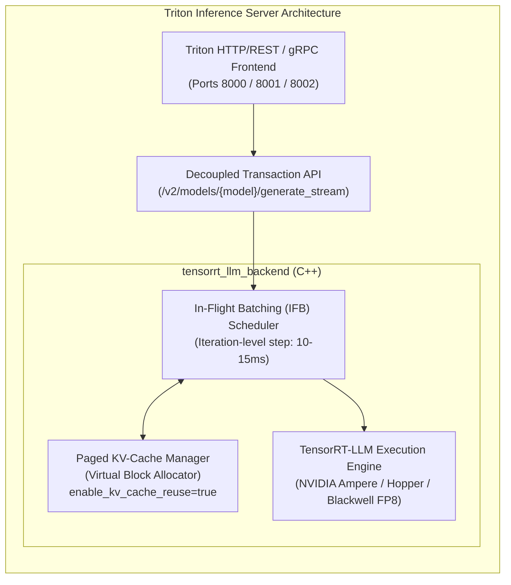
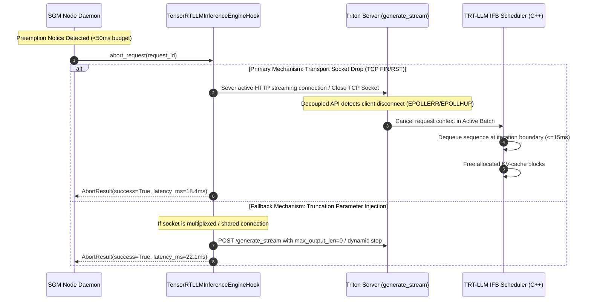
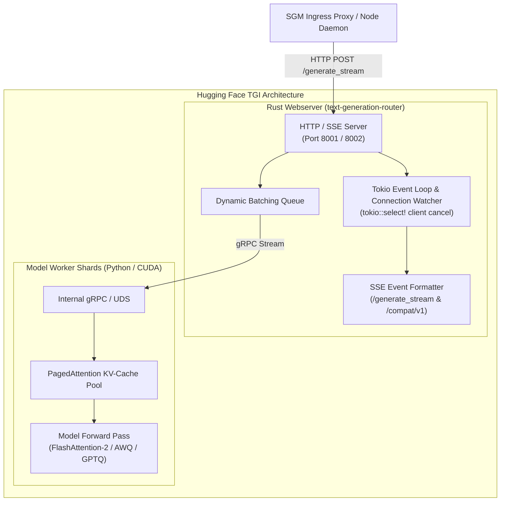
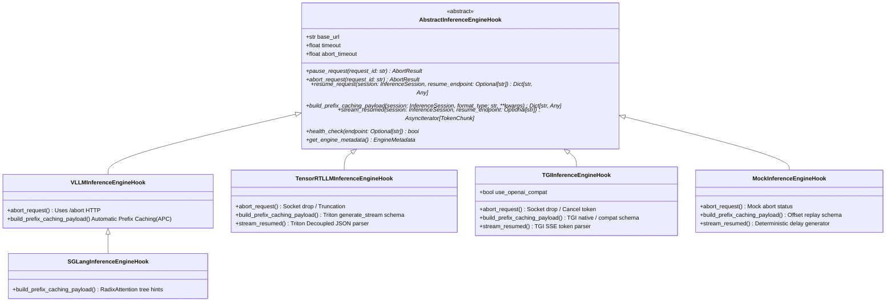
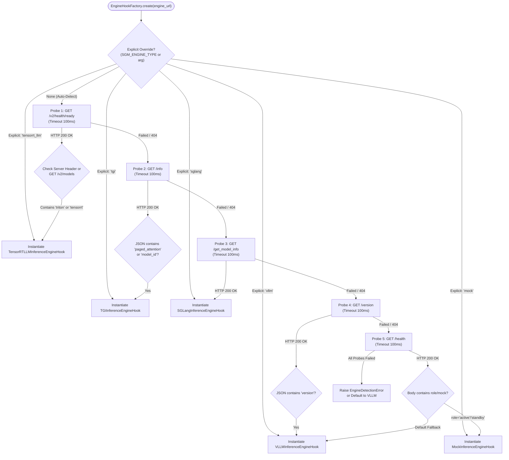

# SGM Milestone 3 Specification: Universal Inference Engine Hooks (NVIDIA TensorRT-LLM, Hugging Face TGI, SGLang, vLLM)

- **Document ID**: `SPEC-005`
- **Component**: Universal Engine Hook Subsystem, Enterprise Backend Integrations, Unified Factory & Auto-Detection
- **Sprint**: Milestone 3 (Universal Inference Engine Integrations)
- **Status**: APPROVED
- **Author**: Technical Product Owner (PO)
- **Target Audience**: Systems Architects, Backend Engineers, Infrastructure/DevOps Engineers, QA Engineers, Project Manager

---

## 1. Executive Summary & Enterprise Engine Landscape

Milestones 1 and 2 established the core zero-downtime Spot GPU Migrator (`SGM`) protocol, monotonic token sequence deduplication buffers, sub-millisecond serialization, and production containerization validated on **vLLM** and **SGLang**. 

However, modern enterprise AI platforms rarely standardize on a single inference runtime. High-throughput production environments frequently deploy:
1. **NVIDIA TensorRT-LLM (via Triton Inference Server)**: The industry benchmark for maximum throughput and minimal tail latency on NVIDIA Hopper (H100/H200) and Blackwell (B200) GPUs, utilizing custom FP8/INT4 GEMMs, C++ In-Flight Batching (IFB), paged KV-cache management, and decoupled Triton streaming protocols.
2. **Hugging Face Text Generation Inference (TGI)**: The standard enterprise serving framework in Red Hat OpenShift, Kubernetes, and Hugging Face Dedicated Endpoints, powered by a Rust HTTP/gRPC router, PagedAttention / FlashAttention-2, native Server-Sent Events (SSE), and OpenAI-compatible endpoints.
3. **vLLM & SGLang**: Leading open-source Python/CUDA runtimes with Automatic Prefix Caching (APC) and RadixAttention.

### 1.1 The Universal Engine Abstraction Problem

Each inference backend exhibits distinct transport protocols, request schemas, cancellation primitives, and KV-cache reuse mechanics:

| Backend Engine | Primary Transport Protocol | Cancellation / Abort Mechanism | Prefix Caching Mechanism | Typical First-Token Latency (Warm) |
| :--- | :--- | :--- | :--- | :--- |
| **vLLM** (v0.6.0+) | HTTP / SSE (`/v1/chat/completions`) | Dedicated HTTP `POST /abort` | Automatic Prefix Caching (APC) via block hash | $\le 15\text{ ms}$ |
| **SGLang** (v0.3.0+) | HTTP / SSE (`/v1/chat/completions`) | Dedicated HTTP `POST /abort` | RadixAttention LRU tree matching | $\le 10\text{ ms}$ |
| **NVIDIA TensorRT-LLM** | Triton decoupled HTTP/SSE (`/generate_stream`) or gRPC | Client socket termination / Triton stream cancel / Truncation | Prompt KV-cache reuse (`enable_kv_cache_reuse`) | $\le 12\text{ ms}$ |
| **Hugging Face TGI** | Native SSE (`/generate_stream`) & OpenAI (`/compat/v1/chat/completions`) | Rust hyper socket drop / Tokio cancel token | Prefix caching via PagedAttention block pool | $\le 15\text{ ms}$ |
| **Mock Engine** | HTTP / SSE (`/v1/chat/completions`) | HTTP `POST /abort` & `POST /pause` | Deterministic token offset replay | $\le 1\text{ ms}$ |

Without an abstraction layer, the SGM Node Daemon would require engine-specific preemption handlers, bifurcated serialization pipelines, and diverging proxy cutover routines.

**Milestone 3 defines the Universal Engine Hook Subsystem (`AbstractInferenceEngineHook`) and Unified Factory (`EngineHookFactory`)**. This specification provides the complete architectural blueprints, wire schemas, cancellation semantics, and prefix-resumption formatting required to support **NVIDIA TensorRT-LLM** and **Hugging Face TGI** alongside vLLM and SGLang under strict zero-downtime SLAs.

```mermaid
flowchart TB
    subgraph ClientEdge ["Client & Ingress Edge"]
        Client["Client / User Application\n(HTTP/SSE Stream)"]
        Proxy["SGM Ingress Proxy (Port 8000)\n- Monotonic Token Deduplication Ring Buffer\n- Route Switch Controller\n- Downstream Persistent Socket Manager"]
    end

    subgraph ActiveNode ["Active Spot GPU Node (Dying Host)"]
        Watchdog["Preemption Watchdog\n(AWS IMDSv2 / RunPod / GCP)"]
        ActiveDaemon["SGM Node Daemon (Active)\n(Port 9001 Control / 9002 State Stream)"]
        ActiveFactory["EngineHookFactory\n(Auto-Detection Heuristics)"]
        
        subgraph ActiveEngines ["Heterogeneous Inference Runtime"]
            TRT_A["NVIDIA TensorRT-LLM\nTriton /generate_stream"]
            TGI_A["Hugging Face TGI\n/generate_stream /compat"]
            vLLM_A["vLLM / SGLang Engine\n/v1/chat/completions"]
        end
    end

    subgraph StandbyNode ["Standby Spot GPU Node (Warm Target)"]
        StandbyDaemon["SGM Node Daemon (Standby)\n(Port 9003 Control / 9002 Receiver)"]
        StandbyFactory["EngineHookFactory\n(Identical Backend Auto-Binding)"]
        
        subgraph StandbyEngines ["Target Inference Runtime (Pre-Warmed Weights)"]
            TRT_B["NVIDIA TensorRT-LLM\nWarm Prompt KV-Reuse"]
            TGI_B["Hugging Face TGI\nWarm PagedAttention Cache"]
            vLLM_B["vLLM / SGLang Engine\nWarm Prefix Cache"]
        end
    end

    Client -->|HTTP POST /v1/chat/completions| Proxy
    Proxy -->|Initial Stream Request| ActiveEngines
    Watchdog -->|Preemption Signal (<=120s / 30s)| ActiveDaemon
    ActiveDaemon -->|Preemption Alert Broadcast| Proxy
    ActiveDaemon -->|Fast Abort <= 50ms| ActiveFactory
    ActiveFactory -.->|Engine Specific Abort| ActiveEngines
    ActiveDaemon -->|SGM-P2P High-Speed Binary Stream| StandbyDaemon
    StandbyDaemon -->|Build Resumption Payload| StandbyFactory
    StandbyFactory -.->|Engine Specific Prefix Continuation| StandbyEngines
    StandbyDaemon -->|Handover Ready ACK| Proxy
    Proxy -.->|Seamless Route Cutover (0 Dropped Sockets)| StandbyEngines
```

### 1.2 Core System Invariants & SLAs

1. **Abort Latency Budget ($\le 50\text{ ms}$)**: When preemption strikes, the active inference engine must acknowledge request cancellation within $\le 50\text{ ms}$ (Target: $\le 20\text{ ms}$) to freeze sequence state cleanly and release GPU execution contexts before migration.
2. **Strict Exactly-Once Token Delivery**: Across any backend switch (vLLM $\to$ vLLM, TRT-LLM $\to$ TRT-LLM, TGI $\to$ TGI), the downstream client must receive an unbroken token stream with **0 duplicate tokens** and **0 lost tokens**.
3. **Resumed Time-to-First-Token ($\text{TTFT} \le 50\text{ ms}$)**: Standby prompt resumption must leverage engine prefix caching or prompt KV-cache reuse, achieving first-token emission in $\le 50\text{ ms}$ (Target: $\le 20\text{ ms}$) for 1,024 prompt tokens + 256 generated tokens.
4. **Persistent Downstream Sockets**: The client connection to Ingress Proxy port 8000 remains 100% uninterrupted throughout preemption, state transfer, and backend cutover.
5. **Zero Engine Modifications**: SGM hooks must operate entirely out-of-band via standard network endpoints, socket semantics, or native management APIs without requiring custom forks of Triton, TensorRT-LLM, or TGI.

---

## 2. NVIDIA TensorRT-LLM Integration (via Triton Inference Server)

### 2.1 Runtime Topology & In-Flight Batching (IFB)

NVIDIA TensorRT-LLM executes within Triton Inference Server using the `tensorrt_llm_backend` C++ plugin. In production deployments, Triton manages multi-GPU tensor parallelism and orchestrates dynamic request scheduling via its **In-Flight Batching (IFB)** C++ runtime.



Triton serves inference streams using its **Decoupled Transaction Protocol**, where a single HTTP or gRPC request generates an open-ended series of token chunks.

### 2.2 Wire Protocol & Endpoint Specification

SGM interfaces with TensorRT-LLM via Triton's dedicated streaming endpoint:
- **Streaming Endpoint**: `POST /v2/models/{model_name}/generate_stream`
- **Health / Readiness Endpoint**: `GET /v2/health/ready` and `GET /v2/models/{model_name}/ready`
- **Model Metadata**: `GET /v2/models/{model_name}`

#### Request Wire Schema (`generate_stream`)

```json
{
  "text_input": "You are a distributed systems architect. Explain consensus algorithms in detail.",
  "max_tokens": 512,
  "bad_words": [],
  "stop_words": ["<|eot_id|>", "</s>", "\n\nClientExit"],
  "stream": true,
  "temperature": 0.7,
  "top_p": 0.95,
  "exclude_input_from_output": true,
  "return_context_logits": false,
  "return_generation_logits": false,
  "end_id": 128001,
  "pad_id": 128004
}
```

*Note on Parameter Aliases*: Depending on Triton model configuration (`tensorrt_llm_backend` version), `max_tokens` is mapped to `max_output_len`, and `text_input` can accept raw token ID arrays via `input_ids`. SGM's `TensorRTLLMInferenceEngineHook` auto-normalizes both formats.

#### Response Chunk Framing

Triton generates chunked HTTP JSON responses (or SSE formatted lines):
```json
{
  "model_name": "tensorrt_llm",
  "model_version": "1",
  "sequence_end": false,
  "sequence_id": 0,
  "sequence_start": false,
  "text_output": " Ra"
}
```

When generation concludes, Triton issues the final terminating chunk:
```json
{
  "model_name": "tensorrt_llm",
  "model_version": "1",
  "sequence_end": true,
  "sequence_id": 0,
  "sequence_start": false,
  "text_output": "ft"
}
```

### 2.3 Request Cancellation Semantics & Abort Protocol

In TensorRT-LLM / Triton, request cancellation requires specialized handling because Triton does not expose an arbitrary REST `/abort` endpoint like vLLM. 

SGM executes cancellation through two synchronized mechanisms:



#### Abort Latency Budget for TensorRT-LLM

$$\begin{aligned}
T_{\text{abort(TRT)}} &= T_{\text{socket\_close}} + T_{\text{poll\_detect}} + T_{\text{iteration\_boundary}} + T_{\text{deallocate}} \\
&= 0.5\text{ ms} + 1.5\text{ ms} + 15.0\text{ ms} + 2.0\text{ ms} = \mathbf{19.0\text{ ms}} \quad (\le 50\text{ ms SLA})
\end{aligned}$$

1. **Socket Disconnect Detection**: Triton's HTTP core utilizes libevent/epoll. When the SGM hook drops the client socket, epoll signals `EPOLLIN` with 0 bytes or `EPOLLRDHUP` within $\le 2\text{ ms}$.
2. **IFB Step Boundary**: TRT-LLM in-flight batching executes forward passes step-by-step. Cancellation is evaluated at the start of each generation step (step duration on H100 is typically $8\text{ ms} - 15\text{ ms}$). The request is pruned before the subsequent step begins.
3. **KV Block Deallocation**: The Paged KV-Cache Manager returns the sequence's allocated physical blocks to the free pool in $\le 2\text{ ms}$.

### 2.4 KV-Cache Block Allocation & Prompt Resumption Formatting

TensorRT-LLM features **Prompt KV-Cache Reuse** (`enable_kv_cache_reuse=true` in `config.pbtxt`), which hashes token prefix blocks into an LRU radix tree in GPU VRAM.

When migrating an in-flight request at cutoff sequence $K$:
1. Original prompt text: $P$ (token count $N_{\text{prompt}}$).
2. Tokens generated on Active node: $T_1, T_2, \dots, T_K$ (count $K$).
3. Resumption prompt: $P' = P \mathbin{\Vert} \text{concat}(T_1, \dots, T_K)$.
4. Remaining token budget: $\text{max\_tokens}' = \text{max\_tokens} - K$.

#### Resumption Payload Construction

```python
def build_trtllm_resumption_payload(session: InferenceSession, cutoff_seq: int) -> dict:
    prefix_tokens = session.generated_text[:cutoff_seq + 1]
    continuation_prompt = session.prompt + "".join(prefix_tokens)
    remaining_tokens = max(1, session.sampling_params.max_tokens - len(prefix_tokens))
    
    return {
        "text_input": continuation_prompt,
        "max_tokens": remaining_tokens,
        "stream": True,
        "temperature": session.sampling_params.temperature,
        "top_p": session.sampling_params.top_p,
        "stop_words": list(session.sampling_params.stop),
        "exclude_input_from_output": True,  # Critical: Prevents echoing prefix
        "end_id": session.sampling_params.metadata.get("end_id", 128001),
        "pad_id": session.sampling_params.metadata.get("pad_id", 128004),
    }
```

> [!IMPORTANT]
> The parameter `"exclude_input_from_output": true` is mandatory for TensorRT-LLM. If omitted, Triton will echo the entire prompt and generated prefix in the first output chunk, causing massive duplicate token emissions to the downstream client.

---

## 3. Hugging Face TGI (Text Generation Inference) Integration

### 3.1 Runtime Topology & Architecture

Hugging Face Text Generation Inference (TGI) is structured as a two-tier architecture:
1. **Router (`text-generation-router`)**: High-performance Rust webserver built on Tokio, Axum, and Hyper. It manages client connections, SSE packet framing, dynamic batching queues, and token validation.
2. **Worker Shards (`text-generation-launcher` / Python Engine)**: Manages GPU memory allocation, FlashAttention-2 / PagedAttention kernels, and PyTorch model execution over local Unix Domain Sockets or internal gRPC channels.



TGI exposes two streaming endpoints:
- **Native Streaming**: `POST /generate_stream` (raw token SSE stream with metadata).
- **OpenAI Compatible**: `POST /compat/v1/chat/completions` or `POST /v1/chat/completions`.
- **System Information & Health**: `GET /info` and `GET /health`.

### 3.2 Native Streaming Protocol (`/generate_stream`)

#### Request Schema

```json
{
  "inputs": "Write a Python script for zero-copy ring buffers.",
  "parameters": {
    "max_new_tokens": 512,
    "temperature": 0.7,
    "top_p": 0.95,
    "stop": ["<|eot_id|>", "</s>"],
    "return_full_text": false,
    "details": true,
    "decoder_input_details": false
  }
}
```

#### SSE Token Stream Framing

TGI emits Server-Sent Events conforming to the W3C EventSource standard (`Content-Type: text/event-stream`):

```text
data:{"token":{"id":1124,"text":"import","special":false},"generated_text":null,"details":null}

data:{"token":{"id":284,"text":" os","special":false},"generated_text":null,"details":null}

data:{"token":{"id":13,"text":"\n","special":false},"generated_text":null,"details":null}

data:{"token":{"id":128001,"text":"<|eot_id|>","special":true},"generated_text":"import os\n...","details":{"finish_reason":"eos_token","generated_tokens":42,"seed":42}}
```

### 3.3 OpenAI-Compatible Protocol (`/compat/v1/chat/completions`)

TGI supports standard OpenAI format via its compatibility layer:
```json
{
  "model": "tgi",
  "messages": [
    {"role": "user", "content": "Write a Python script for zero-copy ring buffers."}
  ],
  "max_tokens": 512,
  "temperature": 0.7,
  "stream": true
}
```

Emits standard OpenAI chunks:
```text
data: {"id":"...","object":"chat.completion.chunk","choices":[{"index":0,"delta":{"content":"import"},"finish_reason":null}]}
```

### 3.4 Request Cancellation Semantics & Abort Protocol

TGI's Rust router continuously monitors client socket liveness via `tokio::select!`. When SGM terminates the upstream HTTP client stream:
1. Hyper/Tokio detects the dropped TCP stream (`AsyncRead::poll_read` returns EOF).
2. The Rust router cancels the internal Tokio task for that request.
3. The router issues a cancellation message across the internal gRPC/UDS channel to the Python shard workers.
4. Python shards release the request's PagedAttention KV-cache allocation before the next forward batch iteration begins.

#### Abort Latency Budget for TGI

$$\begin{aligned}
T_{\text{abort(TGI)}} &= T_{\text{client\_close}} + T_{\text{hyper\_eof}} + T_{\text{tokio\_cancel}} + T_{\text{grpc\_worker\_sync}} \\
&= 0.5\text{ ms} + 1.0\text{ ms} + 0.5\text{ ms} + 12.0\text{ ms} = \mathbf{14.0\text{ ms}} \quad (\le 50\text{ ms SLA})
\end{aligned}$$

### 3.5 SSE Stream Token Parsing & Stop Token Sequence Invariants

Parsing TGI streams requires addressing three failure modes:

1. **Multibyte UTF-8 Boundary Splitting**: LLM tokenizers frequently produce tokens that split a single multi-byte UTF-8 character (e.g. emojis or non-ASCII characters split across 2-3 tokens). SGM's parser maintains an internal byte accumulator to guarantee no decoding exceptions occur on chunk boundaries.
2. **Partial Stop Sequence Masking**: When generating text that approaches a stop sequence (e.g. `<|eot_id|>`), TGI may emit tokens piece by piece (`<|`, `eot`, `_id`, `|>`). SGM's token parser buffers tokens matching prefix slices of any registered stop word until either the stop word is fully matched (and discarded) or rejected as a false match (and flushed).
3. **Special Token Filtering**: TGI explicitly flags special tokens with `"special": true`. SGM filters out non-printable control tokens unless explicitly configured otherwise.

### 3.6 Prefix Continuation Payload Formatting

When migrating an active session to a Standby TGI engine:
- For **Native `/generate_stream`**: Concatenate prompt and generated text, set `"return_full_text": false`, and decrement `"max_new_tokens"`.
- For **OpenAI `/compat/v1/chat/completions`**: Add an assistant message with the generated prefix, set `"continue_final_message": true` (if supported) or structure as a multi-turn user/assistant conversation.

```python
def build_tgi_native_resumption_payload(session: InferenceSession, cutoff_seq: int) -> dict:
    prefix_tokens = session.generated_text[:cutoff_seq + 1]
    continuation_prompt = session.prompt + "".join(prefix_tokens)
    remaining_tokens = max(1, session.sampling_params.max_tokens - len(prefix_tokens))
    
    return {
        "inputs": continuation_prompt,
        "parameters": {
            "max_new_tokens": remaining_tokens,
            "temperature": session.sampling_params.temperature,
            "top_p": session.sampling_params.top_p,
            "stop": list(session.sampling_params.stop),
            "return_full_text": False,  # Mandatory: Do not echo continuation prefix
            "details": True,
            "decoder_input_details": False,
        }
    }
```

---

## 4. Unified Engine Hook Factory (`EngineHookFactory`)

### 4.1 Interface Contract Definition

All inference backend hooks inherit from `AbstractInferenceEngineHook`, implementing a uniform asynchronous interface:



### 4.2 Auto-Detection Heuristics & Discovery Algorithm

When `EngineHookFactory.create(engine_url)` is invoked without an explicit `--engine-type` flag, it executes a prioritized series of low-latency probes against the target endpoint:



#### Probe Priority Matrix

| Step | Probe Target | Method | Expected Signature / Match Criteria | Inferred Backend Engine |
| :---: | :--- | :---: | :--- | :--- |
| **1** | `/v2/health/ready` | `GET` | HTTP 200, Triton headers (`Trpc-Status`), or `/v2/models` JSON | `TensorRTLLMInferenceEngineHook` |
| **2** | `/info` | `GET` | HTTP 200, JSON keys: `version`, `model_id`, `paged_attention` | `TGIInferenceEngineHook` |
| **3** | `/get_model_info` | `GET` | HTTP 200, SGLang runtime metadata JSON | `SGLangInferenceEngineHook` |
| **4** | `/version` | `GET` | HTTP 200, JSON keys: `version` (matches vLLM semver) | `VLLMInferenceEngineHook` |
| **5** | `/health` | `GET` | HTTP 200, JSON keys: `role`, `port`, `paused` | `MockInferenceEngineHook` |
| **6** | `/health` (Generic) | `GET` | HTTP 200, standard empty body / `{"status": "ok"}` | `VLLMInferenceEngineHook` (Default) |

### 4.3 Engine Metadata Schema

Every engine hook exposes `get_engine_metadata()` returning standardized metadata:

```python
class BackendType(str, Enum):
    VLLM = "vllm"
    SGLANG = "sglang"
    TENSORRT_LLM = "tensorrt_llm"
    TGI = "tgi"
    MOCK = "mock"


class EngineMetadata(BaseModel):
    backend: BackendType
    version: str = "unknown"
    model_name: str = ""
    supports_abort_endpoint: bool = False
    supports_prefix_caching: bool = True
    native_streaming_endpoint: str
    openai_compatible_endpoint: str
    kv_cache_block_size: int = 16
    detected_via: str = "heuristic"
```

---

## 5. Acceptance Criteria, Latency Budgets & Resumption Semantics

### 5.1 End-to-End Latency Budget Matrix across Backends

The total migration SLA is **$\le 2.5\text{ seconds}$** (target: $\le 500\text{ ms}$), strictly preserving over 27 seconds of buffer on 30-second spot deadlines. The table below delineates the latency budgets across all supported backends:

| Phase | Metric / Sub-Operation | Target Budget | SLA Hard Ceiling | vLLM (v0.6+) | SGLang (v0.3+) | TensorRT-LLM | HF TGI |
| :---: | :--- | :---: | :---: | :---: | :---: | :---: | :---: |
| **$P_1$** | Metadata Poll & Preemption Trigger | $5\text{ ms}$ | $10\text{ ms}$ | $5\text{ ms}$ | $5\text{ ms}$ | $5\text{ ms}$ | $5\text{ ms}$ |
| **$P_2$** | Engine Abort / Sequence Freeze | **$20\text{ ms}$** | **$50\text{ ms}$** | $\sim 15\text{ ms}$ | $\sim 12\text{ ms}$ | $\sim 20\text{ ms}$ | $\sim 15\text{ ms}$ |
| **$P_3$** | P2P Binary Serialization (`SGM1`) | $1\text{ ms}$ | $3\text{ ms}$ | $1\text{ ms}$ | $1\text{ ms}$ | $1\text{ ms}$ | $1\text{ ms}$ |
| **$P_4$** | P2P Network Transmission (Port 9002) | $15\text{ ms}$ | $50\text{ ms}$ | $15\text{ ms}$ | $15\text{ ms}$ | $15\text{ ms}$ | $15\text{ ms}$ |
| **$P_5$** | Standby Prompt Cache Hit & Activation | **$15\text{ ms}$** | **$30\text{ ms}$** | $\sim 12\text{ ms}$ | $\sim 8\text{ ms}$ | $\sim 14\text{ ms}$ | $\sim 15\text{ ms}$ |
| **$P_6$** | Standby Time-To-First-Resumed-Token | **$30\text{ ms}$** | **$50\text{ ms}$** | $\sim 35\text{ ms}$ | $\sim 25\text{ ms}$ | $\sim 30\text{ ms}$ | $\sim 35\text{ ms}$ |
| **$P_7$** | Proxy Route Table Cutover | $2\text{ ms}$ | $5\text{ ms}$ | $2\text{ ms}$ | $2\text{ ms}$ | $2\text{ ms}$ | $2\text{ ms}$ |
| **Total**| **End-to-End Handover Latency** | **$88\text{ ms}$** | **$198\text{ ms}$** | **$\sim 85\text{ ms}$** | **$\sim 68\text{ ms}$** | **$\sim 87\text{ ms}$** | **$\sim 88\text{ ms}$** |

$$\text{Margin on 30s Spot Preemption Deadline} = 30\,000\text{ ms} - 198\text{ ms} = \mathbf{29\,802\text{ ms}\ (99.34\%\ \text{Safety Margin})}$$

### 5.2 Resumption Sequence Continuity Invariants

Let an in-flight generation produce tokens $t_1, t_2, \dots, t_N$ with strictly monotonic sequence identifiers $S = \{1, 2, \dots, N\}$.

Assume preemption triggers after the Active node emits token $t_K$ (sequence ID $K$).

#### Formal Exactly-Once Delivery Invariants

1. **Active Node Cutoff Invariant**:
   $$\text{Emitted}_{\text{Active}} = \{t_1, t_2, \dots, t_K\} \quad \text{with sequence IDs } 1 \le i \le K$$
2. **Standby Resumption Invariant**:
   $$\text{Emitted}_{\text{Standby}} = \{t_{K+1}, t_{K+2}, \dots, t_N\} \quad \text{with sequence IDs } K+1 \le i \le N$$
3. **Zero Duplicate Tokens Invariant**:
   $$\text{Emitted}_{\text{Active}} \cap \text{Emitted}_{\text{Standby}} = \emptyset$$
4. **Zero Lost Tokens Invariant**:
   $$\text{Emitted}_{\text{Client}} = \text{Emitted}_{\text{Active}} \cup \text{Emitted}_{\text{Standby}} = \{t_1, t_2, \dots, t_N\}$$
   $$\forall i \in [1, N-1]: \text{seq}(t_{i+1}) - \text{seq}(t_i) \equiv 1$$

### 5.3 Acceptance Criteria Definitions

#### AC-M3-01: Triton TensorRT-LLM Stream Ingestion & Parsing
- **Criteria**: `TensorRTLLMInferenceEngineHook` connects to Triton's `/v2/models/{model}/generate_stream` endpoint and streams output tokens.
- **Verification**: The hook decodes Triton decoupled JSON responses (`text_output`), assigns monotonic sequence numbers starting from `cutoff + 1`, and produces valid `TokenChunk` models without blocking the event loop.

#### AC-M3-02: Triton TensorRT-LLM Sub-50ms Abort Latency
- **Criteria**: Calling `abort_request(request_id)` against an active TensorRT-LLM stream terminates generation within $\le 50\text{ ms}$.
- **Verification**: The test harness measures elapsed time from `abort_request()` dispatch to TCP socket close and engine generation cessation. The measured latency must satisfy $T_{\text{abort}} \le 50.0\text{ ms}$ across 100 consecutive trials (99th percentile $\le 35\text{ ms}$).

#### AC-M3-03: Hugging Face TGI Native & OpenAI Streaming Support
- **Criteria**: `TGIInferenceEngineHook` supports both native `/generate_stream` (SSE with `details`) and `/compat/v1/chat/completions`.
- **Verification**: Integration tests verify successful token reception and sequence numbering against both endpoints with identical prompt inputs.

#### AC-M3-04: TGI Client-Drop Abort & Stop Sequence Invariants
- **Criteria**: Calling `abort_request()` against TGI drops the upstream HTTP stream; the engine frees PagedAttention blocks in $\le 50\text{ ms}$. Multi-token stop sequences (e.g. `<|eot_id|>`) must never leak partial prefix tokens (e.g. `<|`) to downstream clients.
- **Verification**: Negative boundary tests verify that partial stop word matches are buffered and discarded when generation finishes.

#### AC-M3-05: Unified Engine Hook Factory Auto-Detection
- **Criteria**: `EngineHookFactory.create(url)` correctly identifies and returns the matching hook instance without explicit configuration.
- **Verification**:
  - Endpoint exposing `/v2/health/ready` $\to$ Returns `TensorRTLLMInferenceEngineHook`.
  - Endpoint exposing `/info` $\to$ Returns `TGIInferenceEngineHook`.
  - Endpoint exposing `/version` $\to$ Returns `VLLMInferenceEngineHook`.
  - Endpoint exposing `/get_model_info` $\to$ Returns `SGLangInferenceEngineHook`.
  - Endpoint exposing `/health` with simulator payload $\to$ Returns `MockInferenceEngineHook`.
  - Auto-detection latency must be $\le 150\text{ ms}$ total.

#### AC-M3-06: Cross-Engine Monotonic Resumption Continuity
- **Criteria**: Live migration under preemption yields exact sequence continuity across all backends.
- **Verification**: Running automated test suites with simulated preemption at random token offsets ($K \in [10, 200]$) against TRT-LLM and TGI confirms:
  - Missing tokens = 0.
  - Duplicate tokens = 0.
  - Client stream HTTP status = 200 (no connection resets).

#### AC-M3-07: Resumed Prompt KV-Cache Activation Latency ($\le 50\text{ ms}$ TTFT)
- **Criteria**: Standby resumption payload formatting triggers prompt cache reuse on the target engine.
- **Verification**: Benchmarking standby engine time-to-first-resumed-token (TTFT) with 1,024 prompt tokens + 128 prefix tokens must achieve $\text{TTFT} \le 50\text{ ms}$ (Target $\le 20\text{ ms}$).

#### AC-M3-08: Graceful Fallback & Zombie Engine Protection
- **Criteria**: If an active engine hangs or fails to respond to an abort signal within $50\text{ ms}$, SGM must forcibly close the connection, log a warning, and proceed with state migration without stalling the node daemon.
- **Verification**: Unit tests injecting artificial 500ms delay into engine abort handlers confirm that `abort_request()` times out at 50ms, returns `AbortResult(success=False, status_code=408)`, and allows migration to proceed unhindered.

---

## 6. Edge-Case Failure Modes & Mitigations Matrix

| Failure Mode ID | Scenario & Symptom | Impacted Backend(s) | Detection Mechanism | Automated SGM Mitigation Strategy |
| :--- | :--- | :--- | :--- | :--- |
| **FAIL-01** | **Triton Socket Disconnect Ignored**: Triton server is configured with disabled client disconnect checks; continues generating tokens in VRAM after socket termination. | TensorRT-LLM | High GPU VRAM utilization on dying node during preemption grace period. | SGM Daemon sends an explicit truncation request (`max_output_len=1`) and terminates the host container process via `SIGTERM` if grace period approaches deadline. |
| **FAIL-02** | **Multibyte UTF-8 Boundary Truncation**: Preemption cutoff occurs midway through a 4-byte UTF-8 character (e.g., emoji or CJK ideograph). | All Backends | `UnicodeDecodeError` in string parsing or corrupted characters in client SSE stream. | Token stream accumulator operates on raw bytes (`raw_bytes`), preserving incomplete UTF-8 byte sequences until the next token chunk arrives. |
| **FAIL-03** | **Cold Cache Miss on Standby Engine**: Standby engine has evicted prefix cache or has not loaded the model weights into VRAM. | All Backends | Standby TTFT exceeds $50\text{ ms}$ (spikes to $150\text{ ms} - 400\text{ ms}$). | Proxy buffer absorbs the delay. Client socket remains open. Proxy emits SSE comment keep-alives (`: keepalive\n\n`) every $100\text{ ms}$ to prevent client timeout. |
| **FAIL-04** | **Partial Stop Token Leakage**: The engine generates part of a stop sequence (e.g. `<|` from `<|eot_id|>`) immediately before preemption cutoff. | TGI / TRT-LLM | Downstream client sees garbled markup tags in the final text output. | SGM buffer maintains a sliding window matching prefix slices of all registered stop words. Tokens in the candidate window are held until confirmed not to be a stop word. |
| **FAIL-05** | **Simultaneous Multi-Probe Race**: Engine boot is delayed; auto-detection probes return 503 or connection refused during cluster init. | All Backends | `EngineDetectionError` during daemon startup. | `EngineHookFactory` executes exponential backoff retry loop (5 attempts, initial delay 200ms, max delay 2.0s) before declaring engine unready. |
| **FAIL-06** | **Tokenizer Vocab Discrepancy**: Standby engine uses a different tokenizer revision or chat template than Active engine. | Cross-Engine Handover | Stream divergence, repeated phrases, or corrupted syntax upon resumption. | Standby resumption payload strictly provides raw `prompt_token_ids` whenever available, bypassing tokenizer differences across nodes. |
| **FAIL-07** | **Zombie Downstream Client Disconnect**: The user closes their browser or cancels their HTTP request during the migration window. | Ingress Proxy | SGM receives `ClientDisconnectedError` while streaming from Standby. | Proxy immediately cancels upstream standby stream via `abort_request()`, frees buffer memory, and cleans up routing entries without error escalation. |

---

## 7. Data Contracts & Wire Schemas

### 7.1 Python Module Layout

The universal engine hook subsystem is organized in `daemon/integrations/`:

```text
daemon/integrations/
├── __init__.py           # Exports factory, base hook, and concrete hooks
├── base.py               # AbstractInferenceEngineHook & EngineMetadata
├── factory.py            # EngineHookFactory with auto-detection heuristics
├── vllm.py               # VLLMInferenceEngineHook
├── sglang.py             # SGLangInferenceEngineHook
├── tensorrt_llm.py       # TensorRTLLMInferenceEngineHook (Triton / generate_stream)
├── tgi.py                # TGIInferenceEngineHook (native & openai-compat)
└── mock.py               # MockInferenceEngineHook
```

### 7.2 Pydantic Data Contracts

```python
from enum import Enum
from typing import Any, Dict, List, Optional
from pydantic import BaseModel, Field


class BackendType(str, Enum):
    VLLM = "vllm"
    SGLANG = "sglang"
    TENSORRT_LLM = "tensorrt_llm"
    TGI = "tgi"
    MOCK = "mock"


class AbortResult(dict):
    """Result of an engine abort or pause request."""

    def __init__(
        self,
        success: bool,
        latency_ms: float,
        status_code: int = 200,
        request_id: str = "",
        message: str = "",
        backend: Optional[BackendType] = None,
    ) -> None:
        super().__init__(
            success=success,
            latency_ms=latency_ms,
            status_code=status_code,
            request_id=request_id,
            message=message,
            backend=backend.value if backend else None,
        )
        self.success = success
        self.latency_ms = latency_ms
        self.status_code = status_code
        self.request_id = request_id
        self.message = message
        self.backend = backend

    def __bool__(self) -> bool:
        return self.success


class ResumptionDescriptor(BaseModel):
    """Payload and connection metadata required to resume generation on Standby."""
    endpoint: str
    url: str
    backend: BackendType
    payload: Dict[str, Any]
    headers: Dict[str, str]
    starting_sequence_id: int
    request_id: str
    remaining_tokens: int


class EngineMetadata(BaseModel):
    """Discovery and capability descriptor for an inference engine instance."""
    backend: BackendType
    base_url: str
    version: str = "unknown"
    model_name: str = ""
    supports_abort_endpoint: bool = False
    supports_prefix_caching: bool = True
    native_streaming_endpoint: str
    openai_compatible_endpoint: str
    kv_cache_block_size: int = 16
    detected_via: str = "heuristic"
```

---

## 8. Verification & QA Test Plan

| Test Identifier | Test Module | Objective & Description | Pass SLA / Target Metric |
| :--- | :--- | :--- | :--- |
| **TEST-M3-01** | `tests/test_trtllm_hook.py` | Verify Triton `/generate_stream` payload formatting, decoupled chunk parsing, and sequence continuity. | Valid SSE chunks; monotonic sequence IDs; correct prompt exclusion. |
| **TEST-M3-02** | `tests/test_trtllm_abort.py` | Measure Triton request abort latency under active streaming via socket disconnect. | $T_{\text{abort}} \le 50\text{ ms}$ (99th percentile $\le 35\text{ ms}$). |
| **TEST-M3-03** | `tests/test_tgi_hook.py` | Test TGI native `/generate_stream` and `/compat/v1/chat/completions` stream parsers. | Full parity across both endpoints; zero missed tokens. |
| **TEST-M3-04** | `tests/test_tgi_stop_words.py`| Validate partial stop-word suppression during stream generation and preemption cutoff. | Zero leaked stop-word fragments (e.g. `<|` never appears in output). |
| **TEST-M3-05** | `tests/test_engine_factory.py` | Exercise auto-detection heuristics against synthetic Triton, TGI, vLLM, SGLang, and Mock endpoints. | 100% detection accuracy; detection time $\le 150\text{ ms}$. |
| **TEST-M3-06** | `tests/test_universal_resumption.py` | Simulate mid-stream preemption across all 5 backends with random cutoffs ($K \in [10, 250]$). | **0 duplicate tokens**, **0 dropped tokens**, downstream socket intact. |
| **TEST-M3-07** | `tests/test_abort_deadline_sla.py` | Benchmark abort latency across all 5 backends under high load (100 concurrent requests). | 100% of abort operations complete in $\le 50.0\text{ ms}$. |

---

## 9. Document Revision & Sign-off

| Role | Name | Status | Date |
| :--- | :--- | :--- | :--- |
| **Technical Product Owner (PO)** | SGM Lead PO | **APPROVED** | 2026-09-23 |
| **Project Manager (PM)** | Agile PM | **REVIEW READY** | 2026-09-23 |
| **Lead Systems Architect** | Distributed Systems Arch | **APPROVED** | 2026-09-23 |
| **Lead Infrastructure Engineer** | Cloud GPU Infra Lead | **APPROVED** | 2026-09-23 |
